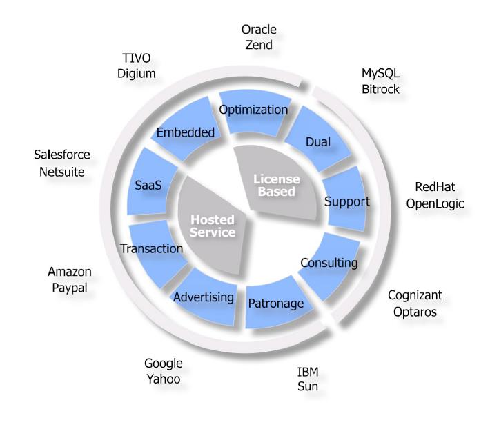

# 2. 文献综述

## a. 方法

此关于一般意义上开源的影响以及特殊意义上 OSS 和 OSH 的影响的文献综述基于三大数据库的搜索结果：Google Scholar、Scopus 和 Web of Science。这些搜索通过应用某种非常宽泛的方式而逐步进行，它随后被缩窄到专门应对 OSS 和 OSH 的不同影响的文献。

总体来说，事实上的开放文献数据库 Google Scholar 一方面包括了经过同行评审的期刊和书籍，另一方面也在更大程度上包括未经评审的出版物，包括政策文献等，当一般性地查找“Open Source”时生成了 200 多万条来源。另两个数据库 Scopus 和 Web of Science 仅包括经过同行评审的期刊论文、书籍以及会议论文集等，分别显示了 7 万和 3 万多篇出版物。总体来看，每年发表的文献数量仍在上升，但是在这两个数据库中正在接近某个固定水平。

将搜索缩窄至“Open Source”和“impact”的组合仍然在 Google Scholar 中给出了 100 多万部出版物，然而在 Scopus 中只有大约 4500 篇，在 Web of Science 中只有大约 3000 篇。其后者在收录期刊和会议论文集时，对于同行评审过程以及科学质量相对于 Scopus 更加严格。总体上看，每年这一出版物子集的数量只是略微上升，并且趋向于某个固定值。

这 3000 多篇出版物的摘要经过筛选，进一步精简的出版物子集根据下列标题而构建出来。

## b. 在其他概念的上下文环境中的 OSS

OSS 尤其并未单独在关于管理的文献中被讨论，然而在始于二十年前由 Chesbrough (2003) 提出的开放创新的更为宽泛的概念的上下文环境中得以讨论。随着从闭源创新到开放创新的范型转变，用户创新这一概念（由 von Hippel 所开发）被特别地引进了。在这一模型中，软件开发者可以被归类为一种特殊类别的用户创新者。与之并行地，开源甚至与此同时在奥斯陆手册的第四版于 2018 年发布时被首次整合至其中。

“开源”这一术语通常被应用于由不同的贡献者共同开发的创新。尽管诸如软件代码等开源产出可以被包含于出售的产品中，特许权使用费很少被付给贡献者，而关于这些产出被如何使用则通常没有显著的限制。确实，开源许可证（如同该术语由开放源代码促进会所定义的）不可提供任何权利金支付或者对于其产出可以被如何部署的任何限制。对于开源产出的后续附加物可能也需要基于某种“开源”基础而提供 (OECD/Eurostat 2019, p.133)。

更近一段时期，OSS 开始在众包的上下文环境中被讨论，这是开放创新的上下文环境中的一种特殊方式。此外，对于源代码的共同开发属于某种共同生产。最后，OSS 产生了新的商业模型，这些已经在文献中被讨论。在下文各节中，OSS 被置于这些创新概念的上下文环境之中。

### 开放创新的上下文环境中的 OSS

自从 Chesbrough (2003) 关于开放创新的开创性论文发表之后，若干位学者开发出了不同的分类法，而开源也被整合至其中。作为其结果，大量同时应对开放创新和开源的论文被发表。

对开放创新进行分类的一种可选方法由 Huizingh (2011) 提出，此人区分了创新过程以及创新成果中的开放性。其特征为创新过程和创新成果同时具有开放性的类别被标记为开放创新。对于他而言，OSS 是这一类别的最为广为人知的范例，而无需进一步解释。

表 2.1 基于创新过程和创新成果的开放性的不同创新方式 (Huizingh 2011, S.3)

| 创新过程 | | 创新成果 |
| --- | --- | --- |
| | 封闭 | 开放 |
| 封闭 | 1. 封闭创新 | 3. 公共创新 |
| 开放 | 2. 私有创新 | 4. 开放创新 |

Dahlanger 和 Gann (2010) 一方面使用输入型（获取）和输出型（展示）创新，另一方面使用金钱和非金钱的交互来区分四种形式的开放性。在此分类法之内，OSS 被归类为非金钱的输出型创新。诸如 Linux (Henkel 2006) 以及诸如 Apple 或者 IBM 等将支持 OSS 作为其平台战略的一部分的私有平台被提及 (West 2003)。这里被指出为缺少一种强大的知识产权管理体制，因此有着发生累积进展的更大机会，类似于 OSS 所取得的发展 (West and Gallagher 2006)。

表 2.2 开放性的不同形式的结构

| | 输入型创新 | 输出型创新 |
| --- | --- | --- |
| 金钱型 | 并购 | 出售 |
| 非金钱型 | 获取 | 展示 |

West 和 Bogers (2014) 专注于在开放创新的上下文环境中撬动外部资源，通过区分获取、整合、商业化，以及最终的交互这四个阶段。OSS 可以被看作用户创新（参见下一节）。然而，企业利用 OSS 社区是为了进行诸如提供商品技术 (West, 2003)、参与非正式知识分享 (Henkel, 2006)，以及为现存产品开发潜在的改进 (Dahlander and Magnusson, 2008) 等事情。尽管“免费搭车”初看起来是企业的一种合理经济战略，它们授权其雇员为社区的创新努力做贡献，以获得合法性以及对于社区创新的访问 (诸如 Dahlander and Wallin, 2006; Henkel, 2006 等文献)。根据 West 和 Lakhani (2008)，开放创新社区被定义为正在进行的个人或者组织的义务联合，这些个人和组织是被赢利的参与者组织起来或者撬动的。它们不同于拥有会员制度、身份和组织忠诚度的网络 (von Hippel, 2007)。OSS 社区被 West 和 Gallagher (2006) 构想为企业同企业的合作，以便聚集创新资源，而 Dahlander 和 Wallin (2006) 专注于业余爱好者和企业雇员之间的交互。更进一步地，企业在投资于 OSS 社区的资源以及从 OSS 社区获取的创新之间的权衡被诸如 Spaeth 等人 (2010) 和 Stam (2009) 等文献分析。此外，企业还必须权衡通过 OSS 分享代码和其他知识得到的好处以及使得信息、控制权和差异化落入 OSS 社区和潜在竞争对手之手所带来的潜在损失 (Stuermer et al. 2009)。

West 和 Gallagher (2006) 在其论文中明确地将开放创新和 OSS 联系起来，通过将具体的 OSS 战略呈现为开放创新所面临的挑战的解决方案，诸如寻找创新性的方式以利用内部创新、将外部创新整合到内部发展之中，并且激励局外人以提供源源不断的外部创新。其一，OSS 可以帮助积累研发以及甚至是产品的开发，就像 Linux。其二，内部开发计划可以通过剥离而成为外部可见的 OSS 项目，诸如 Eclipse 的情况。其三，向自由核心产品出售补充物，诸如 Apache server，但是同时培训并支持与 Linux 相关的服务也是一种选项。其四，补充物不仅可以被出售，页可以被捐赠，例如用户工具包，但是也可包括游戏，诸如 Half-Life，以提供给在技术上有能力的私人或者商业购买者，他们能够生成他们自己对于 OSS 的修改和改进。

此外，von Hippel 和 Krogh (2003) 将 OSS 介绍为一种复杂的“私有集体”创新模型，基于他们对于本世纪之初的一种主要是私人用户驱动的 OSS 开发的认知。他们的模型包含来自“私人投资”和“集体行为”模型中的元素。前一个模型假设基于有效和高效的知识产权保护管理体制，通过私有物品对创新者进行回报。后一个模型假设在市场机制失灵的情况下，例如由于知识外溢，创新者可以合作以便为某种公共物品作贡献。尽管免费展示了源代码，OSS 可以通过推动创新者对于其创新的传播而为其产生私人的好处。与之互补地，他们质疑搭便车者能够以某种公共物品的形式获得来自 OSS 的全部好处，而这是积极贡献者所能够从其开发中内在地获得的。因此，他们宣称 OSS 可以为社会提供“两个世界中最好的东西”。

表 2.3 作为应对开放创新挑战之解决方案的开源策略 (West and Gallagher 2006)

| 开源策略 | 范例 | 最大化内部创新的回报 | 外部创新的作用| 激励外部创新的方法 |
| --- | --- | --- | --- | --- |
| 累积研发/产品开发 | Linux | 参与者共同为共享的努力做贡献 | 积累的贡献对所有人可用 | 持续发展的制度建立合法性和延续性 |
| 剥离 | Eclipse | 播种非商业化的技术以支持其他目标 | 取代内部创新作为持续发展的创新的基础 | 免费访问有价值的技术 |
| 出售补充物 | Apache | 瞄准整个产品解决方案中的最高价值部分 | 外部组成部分为内部开发提供基础 | 企业协调进行中的组件供应 |
| 捐赠补充物 | Half-Life | 为外部贡献者提供可扩展平台 | 为已建立起来的产品增加多样性和创新性 | 认可以及其他非金钱的奖励 |

### OSS、用户创新、众包与共创

尽管 OSS 在此被整合到了关于开放创新的讨论之中，其出发点是 von Hippel 关于用户创新社区的论文，他已经于 2001 年将这些社区同 OSS 项目相关联 (von Hippel 2001)。在此，关注的焦点是消费者或者用户同其他用户共同开发、生产、分配和消费产品，而无需制造商的介入。其后，von Hippel (2007) 介绍了以 OSS 作为其重要范例的创新网络。在此，OSS 的用户只是简单地“使用代码”，依赖于有兴趣的志愿者编写新代码、调试他人的代码、回应发布于互联网求助站点请求，以及帮助协调项目等。首先，他陈述道，没有 OSS 的商业市场，但是他已经观察到随着用户创新网络的生长和成熟，商业企业同用户创新网络建立了联系并且承担了互补性的作用，诸如 Red Hat 分发并提供支持服务，或者 IBM 贩卖互补性的私有软硬件。

在 von Hippel 之后，Bogers 等人 (2010) 特别指出了甚至是在有制造商介入的情况下，OSS 用户能够开发产品的机会，这已经被 Benkler (2006) 强调。此外，关于公司驱动的 OSS 开发，West 和 O’Mahony (2008) 识别了由大学开发的 OSS 中的用户创新初创者。

除了将 OSS 分类为用户社区以外，它们还可以被设想为自治的个人组织 (West & Lakhani 2008; Lerner & Tirole, 2002; O’Mahony, 2003)。

更近一段时间，OSS 还被分类为某种形式的共创 (Zwass 2010) 或者对于共享信息物品的联合累积生产 (West & Lakhani 2008)。它最初被定义为由公司的客户进行的价值共创，但是随后逐渐朝着自治的个人创始的方向延伸。基于新的技术机会，由志愿开发者社区详细叙述的 OSS 开发方法使得它们及其产品能够被整合至组织机构，尤其是公司的生产性的活动中。Zwass (2010) 同时指出了 OSS 的两方面网络效应，由于能够使用基于 OSS 的产品的个人越多，其创造者所得到的认可的价值就越高，该产品继续得到这些有动力的开发者良好维护以用于未来应用的可能性就越大。OSS 的用户有可能通过共创新的 OSS 以及测试和改进现存的 OSS 而同它的开发者一起成为共创者。此外，由个人在数字平台共享数据、信息和知识将会为诸如 OSS 等共创行为的成长作出进一步的贡献。

除了共创以外，OSS 同时还被关联为众包的新方法，这是一种公司用于支持更好的过程和产品的开发和实现的方法。OSS 可以被分类为应用于软件开发的众包 (Olson & Rosacker 2013)。然而，它又是不同的，由于除了大多数开发者由他们的公司或者组织支付薪水这一事实，在 OSS 开发中存在着学习和互惠，还有作为驱动力的自由软件思想 (同时参见 Geiger (2017) 或者由 Nagle et al. 2020 进行的最新调查)。这些特性一般来说并不是众包所固有的，由于众包遵循一种更加自上而下的方法 (Battistella & Nonino 2012)，而声誉和认可是类似的驱动力。

最后一种需要指出的关系是 OSS 同科研之间的关系。尽管 OSS 开发和公众科学之间存在重大区别 (Franzoni & Sauermann 2014)，诸如自组织的程度和社区的作用，OSS 中的创新过程就像科学中的知识创造 (von Krogh & Spaeth 2007)。其一，就像 OSS 那样，科学拥有创造公众利益的目标。其二，OSS 开发可以被构想为某种特殊类型的，由全世界的虚拟团队执行的学术研究 (Bezroukov 1999)，就如同科学可以被如此构想一样。更进一步地，OSS 代码中的更改是由同行驱动的，类似于科学论文必须通过的同行评审。尽管 OSS 和科研工作的贡献者从本质上说更多地是受到同行认可而非经济刺激的驱使 (Bezroukov 1999)，科研人员与 OSS 不同的是，他们一般来说并不使用他们的作品的产出 (von Krogh & Spaeth 2007)。与此同时，对于 OSS 活动的资助来自于那些支付其自身的程序员的公司，这就像它们对于特定基础研究活动的资助。

最后，应用科学的成果可以是 OSS 代码，这在促进包括开放访问和开放数据等方面的开放科学的发展的上下文环境中变得日益流行 (McKiernan et al. 2016)。

### OSS 和商业模型创新

尽管在从业者之间具有大量关于基于 OSS 的商业模型的讨论，只有数量有限的文献明确应对这些商业模型。例如，West 和 Gallagher (2006) 详细论述了四种开源策略，它们部分代表了这种新的商业模型。然而，他们并未明确地将其置于商业模型创新的上下文环境中。关于商业模型创新的研究只是在始于 2010 年的一段时期由于 Chesbrough (2010) 的高引用率的贡献而被适当地建立起来。显而易见的是，致力于开源和开放创新的学者成为了商业模型创新的先行者，尽管他们的作品并未明确阐述这一联系。应当注意的是，Chesbrough (2010) 在讨论商业模型创新的驱动力和障碍时并未提到软件或者开源。显而易见的是，这些研究商业模型创新的学者并未明确专注于 OSS。这一点同样凸显于 Shahrivar 等人 (2018) 的关于基于商业开源的商业模型的广泛综述，它最终仅仅基于大约 30 项研究。与之相反，Jin 和 Ji (2018) 发现“开源”属于商业模型创新相关文献的主要热点，但是没有提供相关出版物的列表。

即使如此，仍有数量有限的关于商业模型和开源的论文，而最近几年的出版物很少。Okoli 和 Nguyen (2016) 可以被看作识别了最为相关的商业模型的最新的可用研究（通过依赖于 OSS 领域的专家访谈而获得）。新的商业模型通过技术发展（诸如软件即服务）而出现，但是它们一般来说并未被研究商业模型的学者所应对。尽管对于文献的深入综述并未揭示显著数量的将开源同商业模型相关联的文献，确实有少数例外。然而，Ebert (2007) 确实识别了新的商业模型，包括分发模型以及诸如责任支持等新服务，由开源、过程创新、新技术、高质量，以及作为其他类型的创新的新架构和新标准驱动。最近，Riehle (2019) 确认了商业模型创新区分为以赢利为目的的模型以及作为除了诸如许可证、工具和过程等法律创新以外的一类创新的开源基金会。总而言之，仍然可以假设，在日益增加的关于商业模型创新的文献同关于开源的文献之间存在着显著的研究鸿沟。

## c. OSS 经济学

最终，OSS 经济学得到了阐述。早期研究将 OSS 的开发定性为公共物品的动态提供，就像 Johnson (2002) 专注于 GNU/Linux 操作系统的范例。在他们的模型中，个人用户程序员决定是否投入自己的努力以开发一种如果按此方式开发就将成为公共物品的软件改进。然而，这还显示了搭便车行为可能会阻止有价值的 OSS 代码的开发。Hawkins (2004) 将 OSS 定义为“准公共物品”，而非公共物品，其生产成本与社会效益相比不大，但是与私人收益相比很大。以 Apache 为例，Hawkins (2004) 争论道，对于 IBM 而言，相对于保持并维护自己的私有解决方案，投资 OSS 代码更加有利可图，由于 IBM 无需承担提供这种准公共物品的全部成本。Bitzer 等人 (2007) 也将 OSS 构想为一种公共物品，但是他们将 OSS 的开发理解为对于公共物品的私人提供，这是由可玩性或者游戏人的收益，以及用户程序员和礼物经济的利益驱动的。Kubiszewski 等人 (2010) 将 OSS 构想为作为公共物品的一种子类别的信息物品，它由于更多用途而得到了增强。在他们看来，这种基于由他们的贡献而得来的个人声誉的状态驱动激励结构是 OSS 开发的主要驱动力。

Lee 和 Cole (2003) 提出了一种略微不同的方式，他们将 OSS，尤其是 Linux 内核开发项目构想为基于社区的知识创造模型，而非基于公司的模型。其特征是由批评和错误校正驱动的学习进化过程。

在 Raymond (1999) 之后，Bergquist 和 Ljungberg (2001) 将 OSS 代码的开发理解为礼物经济的结果，它创造了人与人之间开放性和关系。OSS 礼物赠与基于声誉的理念将这些关系转变为相互依赖性。给予者通过发布此人所开发的代码获得权力，但这也是一种保证代码质量的方式，由于可能由同行作出的检查和校正。

Demil 和 Lecocq (2006) 在 Raymond (1999) 的启示下引入了集市管理模型以基于交易成本经济学描述 OSS 项目的管理结构。由于低级别控制和弱激励强度是这种集市经济的独有特性，存在关于交易的高度不确定性。然而，集市管理推进了 OSS 社区的开放性，这产生了强大的正面网络界外效应，以及由此产生的累积交易的效率。同样是受到由 Raymond (1999) 引进的集市模型，Fitzgerald (2006) 强调了关注的焦点由 OSS 代码开发转移到了 OSS 产品送达和支持服务上。

Lerner 和 Tirole (2002, 2005) 分析了 OSS 的劳动经济学。他们争论道，事业考虑是 OSS 开发者的重要驱动力，由于更好的未来职业以及上述同行认可所产生的自我满足的激励。尽管没有深入阐述，Lerner 和 Tirole (2002, 2005) 还提到了 OSS 同确保兼容性和设置开放标准之间的相关性，这包括它在同垄断公司的斗争中的作用。这与 Bonaccorsi 和 Rossi (2003) 的发现相一致，他们发现 OSS 分散于私有标准所统治的环境中。通过将 OSS 代码的贡献定性为选择性地揭示知识，尤其是作为创造新的发展道路的解决方案，Alexy 等人 (2013) 得出了关于它的使用的若干建议。第一，展示 OSS 代码可以被用于引发那些提供互补性素材和服务的公司的合作行为。第二，这种方法可以被使用，如果这些公司拥有从其他公司或组织提供的外部知识中提取价值的能力。第三，对于竞争对手的替代威胁的强度感知为自身公司或组织施加压力以使其对 OSS 代码作出贡献。

## d. OSS 框架条件

在转到关于 OSS 的影响的文献之前，有必要提到一系列必须予以考虑的框架条件。

这些框架条件分为四类。首先，总结了个人和企业为 OSS 作出贡献的动机。其次，考虑了商业模型以及最终的 OSS 管理。

### 个人的动机

根据 von Krogh 等人 (2012) 的完整综述文章，基于 von Krogh 和 von Hippel (2006) 的前期工作，以及由 Battistella 和 Nonino (2012) 所作的调查作为补充，发现了开发者为 OSS 作出贡献的下列类别的动机。根据 Nagle 等人 (2020)，尽管仍占内在动机思想的主导地位，利他主义和乐趣已经同声誉、互惠、学习、自用相区分，作为一种内在化了的外在动机，而事业和报酬则是纯粹的外部驱动力。他们进一步提议区分短期和长期的动机。这些区分可以通过以下方式被观察到，根据贡献的类型 (Oreg and Nov 2008)、开发者收到的报酬，以及应用的类型，例如 Bosu 等人 (2019) 关于区块链领域的 OSS 开发者的动机。与上述内在和外在动机之间的区分互补的是，Bagozzi 和 Dholakia (2006) 发现了在 Linux 用户组中参与 OSS 的认知性（态度、构想的行为控制，以及对于开源运动的认同）、情感性（积极和消极的预期情感）、社会性（社会认同）的决定因素 (Bagozzi & Dholakia 2006)。更进一步地，动机可能随着时间推移而发生变化 (Shah 2006)。上下文因素对于贡献者的动机具有强烈影响，例如管理 (Shah 2006)，它包括基于社区的信誉和赞助公司的开放性 (Spaeth et al. 2015)，还包括对于 OSS 项目管理的满足 (Iskoujin & Roberts 2015)。特别地，项目许可证的开放程度对于内在动机、声誉，以及劳动力市场信号等方面至关重要，而对于互惠性的作用更加有限 (Belenzon & Schankerman 2015)。最后，开发者对于报酬的接受程度受到他们的动机类型的影响 (Krishnamurthy et al. 2014)，但是报酬也会改变他们的动机 (Roberts et al. 2006)。

### 公司的动机

尽管开发者的动机曾经是早期 OSS 研究的焦点，这种焦点已经转移到了对于公司的动机和策略的考虑上来。在关于 OSS 经济的章节，选择性公开源代码的策略已经有所提及。然而，它被强调为一种特殊的公司策略 (Henkel 2006)，它高度依赖于公司的整体特征和策略。特别地，公司通过应用不同的可访问性与透明性方法 (West & O’Mahony 2008) 寻求访问 OSS 代码并且影响其开发方向 (Dahlander and Wallin 2006)。这些方法取决于公司的目标，即要么是支持更大的增长，这要求更加开放的策略，要么巩固更大的控制，这倾向于更加私有的策略。这些选择随着市场生命周期而变换，并且取决于组织积累的力量 (Appleyard & Chesbrough 2017)。通过在开放创新的上下文环境中引入 OSS，四种策略已经被展现出来，以解释为何公司会投资于同真实和潜在的竞争对手共享的 OSS。这些包括集中研发或者产品开发、剥离、出售补充物以及吸引捐赠的补充物等 (West & Gallagher 2006)。在这种上下文环境中，Dahlander 和 Magnusson (2005) 引进了一种关于应对公司和 OSS 社区之间的共栖、共生以及寄生性的方法的拓扑结构。OSS 也可以在公司的品牌策略中起到重要作用，其中，OSS 代表的是企业开放进化的最终阶段 (Pitt et al. 2006)。

有若干因素会影响公司的策略和动机。如上文所述，一般的公司特性具有重要作用 (例如 Henkel 2006 等文献)。此外，公司在其态度取向以及它们对于知识产权权利的采纳等方面具有显著差别，再加上它们所拥有的主要是专利和商标的知识产权文件夹的规模和强度，这些对于决定哪些公司发布 OSS 并且将 OSS 整合至它们的商业产品之中 (Fosfuri et al. 2008) 以及作为技术、组织、环境等方面的决定因素 (Chauhan et al. 2018) 具有一定的作用。甚至有提供双重授权许可模型的选项 (Välimäki 2003)。然而，不仅仅是公司的特征具有决定性，它们同 OSS 社区的联系模式也如此，即如果公司寻求产生新的策略机遇，它们应该创造一种开放的联系环境 (Foss et al. 2016)。对 OSS 项目的贡献的多样化同样与它们的软件产品文件夹的多样性正相关。这种业界内部的多样性甚至通过授权它们的软件开发者在其工作时间自主为其选择的 OSS 项目作出贡献而得到了进一步的促进 (Colombo et al. 2013)。

总的来说，尽管在 OSS 的早期阶段已经有 40% 的 OSS 项目贡献者是“带薪”参与的 (Lakhani and Wolf 2005)，这一比例高于 Ghosh (2006) 所报导的，公司的贡献在某些项目中已经增加到 90% (Zhang et al. 2019)。作为具体的公司范例，IBM 对于 OSS 的采纳已经被诸如 Campbell-Kelly 和 Garcia-Swartz (2009) 等人调研。

### 商业模型

在关于创新的章节，关于商业模型创新的文献已经被讨论，它并未真正被关联到与 OSS 相关的商业模型研究。

如同已经在关于公司的动机的章节中所指出的，公司与其对 OSS 作出贡献以及使用 OSS 相关的行为取决于它们所拥有的互补性财产，尤其是知识产权权利。因此，Bonaccorsi 等人 (2006) 提到了混合商业模型。特别是在 OSS 的早期阶段，公司的策略和商业模型适应于由现任者及其私有标准统治的市场。因此，它们基于不同的授权许可模式同时提供私有软件和 OSS。传统私有平台厂商引入了混合策略以便在整合 OSS 的优势的同时试图保持它们的私有软件的控制，以及使其同其竞争对手相区别 (West 2003)。

在 OSS 开发的其后阶段，引入了更加以用户为中心的 OSS 商业模型。公司通过访问 OSS 社区以延伸其资源基础，使其策略向社区看齐，甚至同化 OSS 社区以便整合并且共享成果 (Dahlander and Magnusson 2008)。这些完整的方法应该包括适当的社会软件设计、透明的知识产权策略、充分的激励体系，以及与赋予雇员权力相伴的进化性学习和培养方法 (Hienerth et al. 2011)。

在开放创新的上下文环境中，Rajala 等人 (2012) 提出了一种两全的方法，它将市场取向同开放创新的原则相结合。这样的方法增强了公司的赢利性，通过有效的市场访问而缩短了上市时间，并且增强了创新能力 (Rajala et al. 2012)。

Koenig (2004) 已经识别了七种基于 OSS 的商业模型：

* 优化
* 双重授权许可
* 咨询
* 订阅
* 捐助
* 托管应用程序
* 嵌入应用程序

基于开源的商业模型遵循 OSS 开发模式的原则。OSS 开发可能是高度合作性的，并且并不限制对于代码的访问。因此，开发者要求预付购买许可证以使用软件是不寻常的。OSS 模式的价值在于，开发者将资源和工作集中起来以便合作式地开发一种使得所有参与者受益的解决方案。OSS 的特殊方面在于，在集中资源之后，开发者使得任何人可以无偿重用其成果。因此，必须找到不同的模型以资助 OSS 开发。

关于基于 OSS 的商业模型的穷尽的、描述清晰的列表难于建立，而关于这一话题只有有限的研究 (参见 Shahrivar et al. 2018 这篇综述)。新的模型通过技术进展（例如软件即服务，SaaS）而涌现出来，而众多模型可以相互重叠。Okoli 和 Nguyen (2016) 的研究可以看作最为广泛的，依赖于专家访谈以识别出依赖于 OSS 的最为相关的商业模型。他们总共识别了 27 种商业模型，其中十种被专家看作是“最值得关注”的。

在这十种商业模型中，有八种是已经建立的商业模型，已经达成了关于它们如何运作的共识。此外，还有两种商业模型是仍在涌现出来并且因此正处于不断变化之中的。

八种已经建立起来的 OSS 商业模型包括：

* 辅助服务
* 合作开发和分发
* 带有服务软件分发的 SaaS
* 双重授权/贩卖例外
* 会员身份与捐赠
* 众筹
* 广告
* 更新订阅

两种正在涌现的 OSS 商业模型包括：

* 出售用户数据
* 软件认证

### OSS 管理原则

关于 OSS 管理的文献十分有限。更为宽泛的 OSS 社区的进化程度超出了 Benkler (2002)、Lerner 和 Tirole (2002)，或者 O’Mahony 和 Ferraro (2007) 等文献所反映的对于个人志愿者驱动的社区的早期理解，朝向一种由业界驱动的连续研发合作塑造的合作模型。这种发展与这些早期的发现并不矛盾，它标志着这样一种社区构成的转变，即代表了整个业界对于 OSS 产品和过程的采纳。它还代表了基于 OSS 许可证的条款的版权授权和涵盖了关于社区如何组织其自身的范式的 OSS 管理之间的更具标志性的区分。特别地，涌现出了这样的商业模型，它将 OSS 授权许可的使用同不利于社区参与的封闭管理相结合，例如 Android 开源计划（AOSP），或者那些版权持有人集中于单一实体中的单一厂商 OSS 产品。

紧密基于 Böhm (2019) 以及 Blind 和 Böhm (2019)，可以总结出下列关于 OSS 管理的近期发现。

OSS 社区的管理仍然是通过全体贡献者的义务参与而塑造出来。仅当满足其自身利益时，个人和组织才会为社区发展作出贡献。尽管某些社区已经拥有决策制定和冲突调解过程和功能，它们不能强制贡献者实施社区决议。参与者总是可以选择不为决策的实施作出贡献，或者完全离开社区。由于这一点，OSS 社区在制定决策时通常会致力于达成共识并且考虑少数人的意见。指导委员会的作用主要是缓和这种寻找共识的过程并且协助贡献。

OSS 社区的最终决策制定者是全体贡献者，每张投票可能会基于该贡献者在这样一种精英管理的组织内的贡献而赋予一定权重。关于特定贡献者的投票权重，存在着不同的方法，由此产生了具有例如创建者领导、合作或者平等主义等特征的管理模式的光谱[^1]。尽管在过去，诸如“仁慈的独裁者”等概念掩盖了没有志愿参与就没有贡献也没有社区这一事实，近年来，社区的管理范式日益形式化，并且建立起了共同的预期。不论是由贡献者选举，还是基于金融贡献由组织委任至社区，代表委员会的任务是日常管理，但是很少着手实施决议，哪怕是针对贡献者中有影响的少数。还有这样一种共识，即社区管理和技术领导是独立的考虑。众多社区组织独立区分行政管理委员会和技术指导委员会。

投票规则反映出了这种基于义务参与的领导的双重性质。投票通常被指认为一人一票模式或者基于这样一种层级模型，其中支付较高会员费的组织基于该状况获得额外的投票以及委员会席位。然而，代表委员会的构成很少转化为对于技术决策的实际影响。技术领导出来自于实际的产品贡献，这只是与行政项目领导部分重叠。

这意味着此选举过程基于项目中的精英领导和组织状态的混合。此选举过程同样不那么具有影响力。由于 OSS 社区中的行政管理相对于促成产品贡献而言处于从属地位，服务于行政管理委员会或者技术指导委员会与其说是特权不如说是责任。如果 OSS 项目的选举代表发挥作用，则该选举要么基于一人一票模式要么基于层级式会员状态。

参与者的个人职责专注于社区实现并且吸引贡献这一总体目标。这要求所有参与的组织同其他贡献者合作以服务于项目的利益，而不论其竞争性的利益。一旦社区成长到了正式组织成为必要的规模，关于这些行为预期的细节通常被列出于由该组织采纳的“行为准则”中，致力于创建一个吸引人的、非歧视性的、具有生产力的社区，以便吸引贡献者和贡献。除了诸如行为准则等明确政策以外，巩固的隐含社区范式将会增强专业性、真诚行动，以及整合至上级伞状组织与更宽泛开源社区之中。

OSS 社区的组织形式从小型自组织团体到具有委任的管理和技术代表的正式结构不等。义务参与决定了这些项目代表并不享受高于项目贡献者的行政权力，而只是对于具体的技术输出具有极其有限的影响。

然而，有些项目雇佣技术和/或行政职员。在这样的情况下，社区组织在执行项目任务时的行为与公司类似。只有少数 OSS 社区是作为独立的合法实体而设置的。近年来建立的大多数更大的合作是在诸如 Eclipse 基金会、Apache 基金会，或者 Linux 基金会等伞状组织之下的，它们是合法组织，提供行政支持、技术基础设施，以及诸如营销和筹资协调等其他功能 (Izquierdo & Cabot 2018)。

职员的作用不能简单地一般化，由于项目的设置差别巨大。在业界驱动的社区，职员通常专注于社区管理和项目重现。某些项目将诸如发行经理等关键的技术贡献者作为职员而雇佣，以使其全职从事其项目。总的来说，OSS 项目的职员总数一般少于参与其中的贡献者的数量，并且专注于启动性和支持性的职责。OSS 社区职员通常并不处于某种作出行政、法律，或者技术决策的地位。

类似地，OSS 生态系统已经进化为全球上下游网络，它将不同的个体社区的工作整合至一个技术栈中，它适合于最终用户以及作为商业产品的软件平台。“更宽泛的 OSS 社区”这一短语描述了这种由各个项目、开发者、研究机构、企业以及参与到 OSS 的创建中来的其他实体组成的全球网络。在这种全球上下游网络中，并不存在中央决策制定者以指导更宽泛的 OSS 社区的工作。更宽泛的 OSS 社区的工作是通过某种下游整合与采纳的不同解决方案之间的竞争的方式来协调的。上下游网络中的社区之间的合作可以有机地发生，通过诸如 Red Hat、SUSE 或者 Canonical 等作为集成产品分发商的公司的支持，或者通过伞状组织的辅助。

这里所呈现的 OSS 管理原则对于理解 OSS 社区的发展和 OSS 的影响来说都是至关重要的。

## e. OSS 的影响

尽管此研究专注于 OSS 的经济影响，此文献调研被区分为不同的亚维度，以便得到完整的情景。它首先专注于经济方面，但是随后专注于公司，还有个人 OSS 贡献者以及 OSS 项目。最后是 OSS 对于社会方面的影响，并且最终考虑了同政策分析相关联的相关政策。

### 对于经济的影响

Lerner 和 Schankerman (2010) 在普遍意义上将软件，以及特别地将 OSS 置于新增长理论的上下文环境中。在原则上，一方面它可以在实质上以零成本提供可用的最好的软件，以利用其非竞争属性的全部优势。另一方面，关于激励机制的问题可以通过开发者（不论是作为个人还是公司）义务为 OSS 开发作出贡献这一事实而得到解决。潜在地，OSS 可能对经济发展具有较大影响。根据一项大规模公司调查的数据库，Lerner 和 Schankerman (2010) 展示了 OSS 和私有软件可以发生相互作用，即公司在贩卖私有软件的同时对开源作出贡献，并且用户广泛地将此二者混合与匹配起来。因此，他们假设在 OSS 和私有软件之间存在实质性的成本协同效应，不论是在产品开发还是在营销过程中。然而，他们并未在经验上展示通过他们的理论考虑而得出的 OSS 对于经济的影响。

Ghafele 和 Gilbert (2014) 将 OSS 概念化为一种其特征为学习和模仿过程的开放创新的原型。基于美国就业结构的转移，他们假设 OSS 可能对于高薪职位的就业增长具有积极影响。然而，他们的发现只是基于就业历史数据的外推。Ghosh (2006) 将 OSS 整合到一种模拟模型中以解释劳动生产率，并且通过对于 OSS 投资的假想复制得出了 0.1% 的 GDP 增长。然而，这一发现并未被经验数据验证。

Ghosh (2006) 的主要论述探索了与软件开发相关的显著节省，这对于经济发展有利。例如，Mockus (2007) 发现，50% 的流行 OSS 的代码经常在若干项目中得到重用。关于这种成本节约效应的经济学原理由 Riehle (2007) 在一种微观经济学模型中详细阐述。此外，Ghosh (2006) 争论道，OSS 潜在地节省业界在软件研发中的投资，这可以产生额外的利润，或者被更有用地花费在未来的创新活动中。Robbins 等人 (2018) 分析了 OSS 作为无形资本的影响。通过代码行来估计付出的努力，他们使用某种改进的国家经济核算方法来估计某些流行的 OSS 包的资源成本。此外，他们估计了由美国联邦政府在 Code.gov 上分享的 OSS 的资源成本。最近，Wright 等人 (2020) 发现了 GitHub 提交数量对于超过 180 个国家样本的 IT 初创企业数量的鲁棒的正影响。

近期，被定性为某种开放创新的 OSS 同样在国家创新体系的上下文环境中被讨论。有争论表示 OSS 正在加强国家创新体系的重要性，并且提高它的有效性以及使其网络多样化 (Wang et al. 2012)。最后，由于 OSS 周围的生态系统和平台，它变得更具包容性，并且由此被提议为一种社会创业的可能策略 (Waitzer & Paul 2011)。

OSS 的竞争效应可能对于私有软件的价格和质量有所影响 (例如 Jaisingh et al. 2008 等文献)。某些质量影响是两方面的 (Choudhary & Zhou 2007)，尽管 OSS 厂商表现出了更多与安全漏洞相关的立即补丁发布 (Arora et al. 2010)，OSS 对于私有软件的价格施加了压力 (Xing 2015)。然而，网络界外效应对于 OSS 同私有软件之间的竞争 (Cheng et al. 2011) 以及与 OSS 相关的用户技能 (Lin 2006) 而言同样重要。最近，August 等人 (2020) 将分析扩展到一种三方博弈并且检查 OSS 许可证如何影响 OSS 发起人、OSS 贡献者，以及在企业软件市场中与之竞争的私有者之间的竞争。在此，OSS 许可证对于市场结局和社会福利具有强烈影响。甚至有经验证据表明，特定的将知识产权权利强制实施于 OSS 项目的方法获得了成功 (Wen et al. 2013)。最近，合并与收购对于 OSS 贡献的相关影响由 Chen 等人 (2018) 进行了分析。

### 对于公司的影响

有若干项研究专注于 OSS 对于单个软件生产与购买公司 (Krishnamurthy 2003) 或者特别是对于中小型企业 (Hendrickson et al. 2012) 的影响。例如，Cereola 等人 (2012) 分析了开源企业资源规划（ERP）软件对于中小型企业的影响。

与上述更加定性的论文相反的是，只有数量有限的定量研究。Aksoy-Yurdagul (2015) 分析了 OSS 商业化对于考虑了诸如软件专利和商标等补充性财产的公司价值的影响。Noda 和 Tansho (2014) 研究了 OSS 的使用和对其成长的贡献对于日本 IT 公司的影响。Nagle (2018, 2019b) 利用公司样本分析了 OSS 的使用和贡献对于公司生产力的影响。Theunissen 等人 (2004) 呈现了一种关于研究 OSS 对于电讯软件开发的影响的定性方法。

尽管非常理论化的经济学研究假设了 OSS 的采用所带来的成本节约影响，根据 Kumar 和 Krishnan (2005)，它与公司的总体 IT 开支，尤其是 IT 劳动开支正相关。

如上文所述，OSS 可以被放在开放创新 (Chesbrough et al. 2006) 的上下文环境中。因此，自外而内的开放创新 (Inauen & Schenker-Wicki 2011) 和内部开放创新 (Parida et al. 2012) 的影响得到了分析。然而，OSS 在此上下文环境中的作用目前并未被明确阐述。其中一个例外是 Piva 等人 (2012) 的研究，他们发现创业风投与 OSS 社区的合作展现了强大的创新效果，相对于非合作的同行而言。

### 对于项目的影响

另一个至少需要被考虑的影响维度是在项目层级，由于 OSS 项目由个人以及公司甚至是基金会等不同组织所共享。

首要的挑战是定义并且衡量 OSS 项目成功与否 (Crowston et al. 2003; Sen et al. 2012; Ghapanchi & Aurum 2012)。其次，找到与 OSS 项目的成功相关的影响因素是至关重要的 (Stewart 2004; Wray et al. 2009;
Koch 2007; Ahuja 2018)。

显而易见的是，项目发起者本身是重要的 (Wang & Wang 2020)，但是运行该项目的领导同样重要 (Neufeld & Gu 2019)。由于 OSS 项目是由开发者网络所开发的，其网络嵌入性 (Grewal et al. 2006)、合作网络 (Singh 2010; Singh et al. 2011; Koo et al. 2017; Sowe et al. 2006)、社会网络 (Barbagallo et al. 2008)，并加上他们的通讯 (Chent et al. 2013) 和反馈结构 (Kavaler et al. 2019) 对于项目的成功至关重要。OSS 项目通常是全球的。因此，参与的开发者的全球分散对于他们的协调和效率，包括软件质量 (Anh et al. 2015; Bird et al. 2012; Daniel et al. 2013) 有所影响。特别地，设计 (Zazworka et al. 2011; D’Ambros & Bacchelli 2010; Fontana et al. 2012; Palomba et al. 2018)、代码审查 (McIntosh et al. 2016; Herzig & Zeller 2013; Rigby et al. 2012; Zanjan et al. 2014; Baysal et al 2013; Hu et al. 2019)、代码重用 (Haefliger et al. 2008; Jiang et al. 2019c) 对于 OSS 的质量及其最终的成功，例如基于安全的设计 (Chehrazi et al. 2016) 具有影响。此外，注释语句影响 OSS 中的代码稳定性 (Aman & Okazaki 2008)。最后，OSS 项目中的工作划分与计时与它们成功与否相关 (Howison & Crowston 2014)。

用户的参与同样对于项目的成功 (Ghanpanchi et al. 2012) 以及探索与利用的结合 (Lee et al. 2019) 具有影响。

作为框架条件，不同类型的许可证确实是重要的 (Subramaniam et al. 2009; Ghapanchi & Aurum 2011)，而经济补偿同样重要 (Atiq & Tripathi 2016; Liao et al. 2019)。

### 对于个人的影响

尽管公司是 OSS 项目的主要驱动力，由于大多数贡献者由他们的公司付给薪水 (Geiger 2017 和 Nagle et al. 2020)，与此同时个人开发者仍然对于 OSS 代码的质量具有重要作用，以及由此对于它的最终影响发挥重要作用。

因此，有研究显示社会联系与合作对于 OSS 项目团队的形成具有强烈影响 (Hahn et al. 2006; Hahn et al. 2008; Qureshi & Fang 2011)。这与开发者工作的最初环境的高度相关性互补 (Zhou & Mockus 2011, 2015)。在后期阶段，社会资本将会影响对于 OSS 的持续参与 (Qiu et al. 2019) 并且对 OSS 项目中的开发者更迭作出贡献 (Lin et al. 2017)。开发者的声誉对代码审查的结果有影响 (Bosu & Carver 2014)。然而，即使是外围开发者也会有所影响 (Setia et al. 2012)。一般来说，OSS 开发者通过他们的同行及其自身经验进行学习 (Singh et al. 2011)。总而言之，领导、团队成员的身份，以及对于公共利益的感知对于 OSS 开发者的满足程度具有影响 (Chang 2018)。

个人开发者同样也会经历私有软件和 OSS 开发之间的冲突 (Rolandsson et al. 2011)，与之互补的是 OSS 社区和参与其中的公司之间在意识形态上的不匹配带来的重大影响 (Daniel et al. 2018)。

### 对于社会的影响

除了对于整体经济以及尤其是活跃于软件领域的公司的影响之外，OSS 还在其他领域具有影响。然而，科研文献比较有限，并且提到了诸如新闻业和印刷业 (Berry 2008)、图书馆和信息科学 (Adhikari 2017)、翻译服务 (Désilets 2007) 和教育 (Brown 2008) 等领域。此外，有一些文献是关于 OSS 对于总体上的安全性 (Hepman & Jacobs 2007)、云安全 (Riquet t al. 2012)、基于安全的设计 (Chehrazi et al. 2016)，以及最终的安全性 (Dobberstein et al. 2017) 的影响的。

除了安全性以及作为公共物品的安全以外，OSS 被认识到同环境科学 (Blower 2019)、灾害影响评估 (Olyazadeh et al. 2016)、能源效率 (Capra et al. 2012)，以及最终同总体上的可持续性 (Fitzgerald et al. 2019) 相关。然而，关于 OSS 在公共部门的作用的近期科研文献很少 (Mergel 2015)。

## f. 关于 OSH 的文献

与大量关于 OSS 的科研文献相反，关于 OSH 的论文相当有限，它们不仅同创新相关，也同商业和经济影响相关。一个例外是关于三维打印或者积层制造的大量文献，诸如小型制造 (Laplume et al. 2016)、无人机 (Ebeid et al. 2018)，或者三维生物打印 (Lee et al. 2017)。基本上属于非常具体的基于案例的技术论文中的进一步话题包括 OSH 对于教学 (Herger & Bodarky 2015; Rodriguez-Sanchez et al. 2015; Schelly et al. 2015) 和研究方面的作用，例如用于显微镜 (Wijnen et al. 2016)、机器人原型、传感器网络、物联网，以及最终应用于医疗，与此同时还包括与应对 Covid-19 的影响相关的医疗设备以及环境保护。OSH 平台的突出范例包括 Arduino (Nayyar & Puri 2016) 等。然而，其经济和金融方面尚未得到分析。

某些研究调查了 OSH 的参与 (Bonvoisin et al. 2018)、动机 (Hausberg & Spaeth 2020) 以及基于 OSH 的公司的创业动机 (Li et al. 2017)。由于 OSH 基于平台原则 (Kim & Hong 2018)，开放性是一个重要方面 (Bonvoisin & Mies 2018)。OSH 被用于产品开发和设计 (Bonvoisin 2017)，其特征为设计的迭代过程，涉及若干专业人士，以及使用 OSH 和 OSS (Spallazzo & Ceconello 2018)。这些开放设计追求复杂的策略。事实证明开源社区相对于硬件开放性而言更加看重软件开放性。例如，Balka 等人 (2010) 发现开放设计公司可以成功实施部分开放性的策略以保证价值获取而不会异化它们的开发者社区。OSH 生态系统中的社区和合伙人集中于设计或者生产，再加上一系列互补的服务以创造价值 (Moritz et al. 2018)。Kim 和 Shin (2016) 将 OSH 置于社会平台创新的上下文环境之中，并且发现内容、消费者支持、用户界面，以及奖励是触发对于社会 OSH 平台的贡献的重要因素。

与更加复杂和多样化的 OSS 商业模型相反，关于 OSH 商业模型的文献非常有限。Pearce (2017) 呈现了下列 OSH 商业模型列表，然而它专注服务于科研社区。

* OSH 制造商（类型 1）
    * 工具包提供商
    * 专用组件提供商
    * 校准与验证服务
* OSH 购买者（类型 2）
    * 贩卖 OSH
    * 贩卖 OSH 服务
    * 实验外包商（类型 3）

Li 和 Seering (2019) 扩展了 Pearce (2017) 的工作，通过在普遍层面上分析基于 OSH 的公司的商业模型。

最后，只有少数关于 OSH 的影响的研究。其中一个范例是 Pearce (2016) 提出的用于确定开发科研用自由和开源硬件（FOSH）的投资回报率的方法。然而这些范例主要专注于开源科研用硬件的开发。更进一步地，工业控制应用中的成本导向的开源自动化潜力得到了调查 (Hoxha et al. 2016)。Kwak 等人 (2018) 以一种互补的方式将视角从单一的三维打印创新扩展到了三维打印技术领域的创新生态系统和平台，这可以启动一场关于 OSH 和包括商业模型在内的创新之间的联系的更为宽泛的讨论。

总而言之，关于 OSH 的文献非常有限，或者专注于具体到案例的范例和技术，也就是说，关于 OSH 的案例研究必须提供关于其经济影响的新见解。

## g. 文献综述小结

此文献综述展示了大量关于 OSS 的科研论文。作为第一步，OSS 被置于开放创新和相关方法的上下文环境中，由于这展示了更为宽广的框架，其中，它的影响最终得到了分析。作为第二步，针对 OSS 考虑了该框架条件，即公司和个人的动机，以及可用的 OSS 商业模型和管理机制。最后，关于 OSS 的影响的文献得到了总结，从经济层级的研究开始。由于这些研究局限于对于公司的影响，作为一个重要层级的项目以及甚至是个人开发者都必须被考虑。它以一段对于 OSH 相关的少数研究的简短综述结束，它应对了经济或者商业方面。

总的来说，此文献综述为此项目将要实施的经验分析和政策综述提供了基础。

[^1]: https://www.redhat.com/en/blog/understanding-open-source-governance-models

