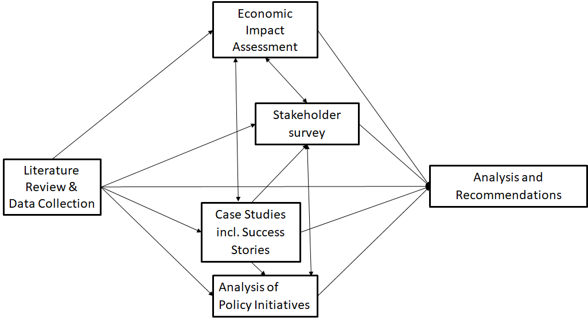

# 3. 方法论概述

## a. 简介

由于尽管对于 OSS 的相关性的认可已有将近二十年（参见文献综述），仍然没有良好建立的方法论以衡量 OSS 的影响，一种基于若干支柱的方法论被开发出来。开发这样一种方法论的挑战对于 OSH 而言更高，由于缺少先前的研究和经验证据，尤其是数据。因此，对于 OSH 采取了一种独立的方法，它主要基于案例研究。

下图显示了我们的不同方法论的概述，以分析 OSS 和 OSH 及其不同影响，基于对于现存文献的完整综述。这些方法将会在后续章节中详细解释。此外，还举行了若干场研讨会，代表不同股东集团的一百多位专家在会上对于与案例研究和政策分析相关的方法进行了评审。

## b. 案例研究、商业模型和命名法

根据文献综述以及同专家的讨论，识别出了若干种命名法，包括商业模型命名法，它们潜在地同此研究的分析阶段相关。对于一系列有意义的命名法的采纳可以达到两种目的。主要目的是保证此研究以某种具有一致性的方式被执行，以使得可以在不同的项目之间进行有效的比较，既对于此研究期间获取的数据，也对于来自于现存来源的可用数据。次要目的是提议一种框架以辅助尤其是案例研究的数据采集，以最小化转换误差与假设的方式。

值得注意的是，尤其是与 OSH 相关时，已有数量有限的数据集合可用。尽管那些已经被用于采集这些现存数据集合的命名法可能对于我们的目的尚不理想，然而，在某些情况下，在不同的命名法之间进行转译是可能的，要么是直接转译，要么是带有相对少量的额外研究以及最小化的信息丢失。在某些情况下，并没有现存的命名法可用，因此要求开发出我们自己的命名法。在其他情况下，存在着互相竞争的命名法，因此必须选择或者采纳一种适当的命名法用于此研究。

在我们最初的专家会议召集期间，有些专家询问，将对于那些专注于商业化私有设计的组织的研究包括进来是否恰当，如果此研究专注于 OSS 和 OSH。看起来，对于 OSSH 的影响的底层研究问题的回答同样包括对于那些吸收并且利用开源的组织的考虑，即使它们所商业化的产品（全部或者主要地）并非开源。这导致了关于“开放性”是否应该以一种更加细致的方式而被考虑这一问题的考虑。在研讨会上讨论的正是关于“多么细致”的问题。类似地，“硬件性”这一概念的引入提示了这一点，即在关于 OSS 的数据采集和分析中存在更多价值，每当可能时使用和用于开放硬件相同的一套命名法。

其他命名法更加直白（诸如同地理相关的）或者是被整体引进以辅助同现存数据集合的整合的（例如，开源硬件协会（OSHA）用于其认证产品数据库的分类方法）。

这些命名法和商业模型分类法被用于数据采集和分析，既在桌面研究阶段，也在评审和调研阶段。

通过使用通过桌面研究和专家输入而获取的数据，若干主要项目被识别出来，并被选作五项案例研究。从这些项目之中，适当的项目被识别为案例研究的输入，并且执行了一系列评审。在五项案例研究中，五个相关的成功案例被识别出来并且详细叙述。基于这些案例研究，进行了一项基于行业领域案例研究的欧洲经济 SWOT 分析。

对于这些案例研究中的商业模型的分析与对于具有成功的基于 OSS 的商业模型的组织的概述，以及对于由 CrunchBase 提供的展示了受影响的部门和技术的多样性的初创企业的更大样本的描述的分析相互补充。最后，对于基于 OSH 的初创企业的较小的样本，进行了一项对于商业模型的深度分析。

## c. 经济影响分析：宏观和微观水平

由于文献综述揭示了 OSS 的若干种影响维度，不同的方法被应用于应对不同层级上的不同影响维度。

起始点是由 GitHub 提供的数据库，它是最重要的开源版本库。从 GitHub 开发者平台获取的 OSS 数据由 TU Delft 在 GHTorrent 项目（<https://ghtorrent.org>）的上下文环境中提供。此来源特别地有希望，并且因此也成为我们关于获得 OSS 的经济影响的方法论的主要数据库。作为最大的 OSS 项目版本库，GitHub 提供了关于各个国家和组织之间的 OSS 流行度的独特的系统化数据。诸如 GitLab 和 Software Heritage 等其他数据库当前尚未提供足够的数据。GitHub 作为数据库的相关性和稳定性是由日益增长的提到 GitHub 的论文数量支撑的。我们的经济分析仅仅涵盖了直到 2018 年的数据。因此，GitHub 被微软接管一事对于我们的分析的影响极小。

然而不幸的是，关于 OSS 代码的扩散的数据基本上不可获得。但是，如同在文献综述中所概述的那样，OSS 可以被看作用户创新或者开发者和用户之间的某种形式的共创。因此，对于 GitHub 上的 OSS 代码的贡献也能反映出它们的使用情况。因此，我们提议依赖于对于 GitHub 上的代码的贡献，根据 Nagle (2019a) 和其他人的研究，这些研究假设对于 OSS 的贡献同样会导致 OSS 的实现。在下一步中，这同样促进了对于贡献者的研究，由于他们从更有经验的用户人群中收到反馈，因此能够更好地从物品的使用中捕获价值 (Nagle 2018)。

由 GitHub 提供的数据将会被用于不同目的。超过 10 亿项提交和超过 3000 万名用户的庞大数量能够生成对于所有欧盟成员国的足够长的、鲁棒的时间序列。这些时间序列被用作宏观经济学面板回归的输入，这允许我们确定 OSS 对于欧盟的 GDP、劳动生产率、竞争性、创新以及市场准入等等的影响。基于 GitHub 活跃用户的提交贡献，有可能计算出 OSS 的宏观经济学影响，它整合了全部的直接与间接影响。然而，由于来自诸如 Eurostat 和 OECD 等得到高度认可的组织的可用宏观经济学变量并非专注于 OSS，而是在总体上关于经济，某些宏观经济学模型并不能产生重大结果。然而，在欧盟成员国的层级上，有可能识别出贡献者和提交的数量，这允许我们计算出必要的投资以作为在欧盟生产 OSS 的成本基线。这些成本数字被同基于这些投资所创造的 GDP 相关联，并且最终用于确定成本收益比例。

此外，由 GitHub 提供的数据同样被用于更加分散的级别，即组织级别。在超过 3200 万名用户中，有 60 多万是挂靠到诸如公司、基金会等组织以及项目的。然而，项目级别并不适合于 OSS 经济影响的分析，由于它们不能归属于具体国家或者整个欧盟，并且没有外部金融数据可用于项目级别。因此我们决定专注于组织，或者更好地，公司以进行微观级别的分析。它被浓缩至具有最多的用户或者贡献者数量的 1 万多个组织。它们吸引了在 GitHub 显示为挂靠到某个组织的用户的三分之一强。将这些组织同 Amadeus 公司数据库相匹配，产生了将近 2000 家位于欧洲的，或者与某个欧盟成员国相关联的公司。

最终，这些公司中的 1000 多家的 2018 年营业额和雇员数量可获得。这一信息同用户，即雇员，以及他们的提交数量相匹配。因此，通过部门、雇员以及营业额的类别将这些公司区分开来是可能的。最终，这些公司对于 OSS 的投资被计算出来，并且与它们的收益相比较，以作为一种成本收益分析。

最后，股东调研中也有一个用于确定成本收益比例的部分。这些比例被再次同宏观和微观经济学成本评估的发现相关联，并且被用于验证目前确定的成本收益比例。

## d. 股东调研

如同上文所示，我们的方法论中的另一个重要元素是完整的股东调研的效果。股东调研的目的是收集并分析大范围股东对于 OSS 和 OSH 的影响这一话题的看法，由此创建一种对于至关重要的看法和问题的鲁棒的经验表达。此外，由来自文献、数据库和案例研究的见解驱动的评估 OSS 和 OSH 的影响的方法通过来自股东调研对象的输入而得到补充。

实施了下列步骤：

1. 以基于事先完成的研究（诸如文献检索、案例研究设计和现存数据调研等）的问卷设计开始
2. 利用基于网页的工具编程设计问卷
3. 实地测试该调研
4. 通过设置联系人数据库准备将问卷送达调研参与者
5. 通过将问卷并加上两条提示信息发送至不同社区和目标团体而执行调研
6. 利用代表最先进技术的软件和统计技术分析结果

调研结构如下所示：

* 回答问卷的个人的职位
* 关于该组织的基本信息（包括关于软硬件规模和商业模型的立场，创新行为等）
* 关于保护该组织或者企业单位的专门技能的策略
* 对于 OSSH 的参与
* 该组织对于 OSSH 的参与形式
* 对于加入 OSSH 开发的激励的相关性
* 版权许可证的作用
* 对于 OSSH 在其中被使用、集成、开发或者参与的领域的区分
* OSSH 带来的成本和收益
* 额外评论，包括对于欧洲联盟委员会对于开源的潜在支持的建议

## e. 最终分析

所有不同分析方法的见解被用于分析和验证最终发现。因此，那些主要是自上而下的，尤其是来自宏观经济学层级的基于经济学分析的主要是定量的发现，通过自下而上生成的，来自股东调研以及最终来自案例研究的主要是定性的见解而加以分析。

因此，经济学分析的结果首先被汇总，随后在以下章节通过股东调查汇总，以及最终通过案例分析而得到补充。最后，这些发现根据参与 OSS 或者 OSH 的股东、主题，以及最终根据影响维度而被组织起来。

这些基于不同来源或者证据的发现构成了得出一般性以及具体话题的政策建议的基础。

## f. 公共政策分析

政策分析的主要目标是识别在目标国家对开源造成影响的相关公共政策行为与因素。在定义用于公共政策研究的最终指标时，对于导出政策建议的需求已经被考虑。用于公共政策分析的目标国家遍布全世界，并且由此展示了对于开源的不同方法。

首先，为了识别相关行为，有必要依赖于不同信息来源。开源不是一个主流公共政策领域，因此关于它的信息通常并非广泛可用，尤其是在各个国家的水平上。为了收集必要的信息，我们利用了学术来源、专家访谈、政府来源和专业研究的组合。这些基于各个国家的水平而加以调整。

尽管在某些国家，学术资源可以获得，并且执行了相对深度的研究，而在其他国家，就大多数国家而言，学术资源不可用。尽管如此，仍有约 150 篇学术论文被筛选出来以用于政策分析的目的。专家访谈是第二重要的信息来源。

专家能够以更加非正式的方式提供信息，提供关于政策行为的成功与失败的上下文环境和背景以及信息，并且因此对于理解未成文法律和文化特殊性，以及在影响到不同国家之间的公共政策的语言鸿沟之间架设桥梁等方面至关重要。专家还能为研究带来重要的起跑优势，发挥事半功倍的作用，以及提供关于学术和政府来源的重要信息。出于公共政策研究的目的，我们进行了超过 50 场专家访谈。这些访谈基于半结构化的问卷。

政府，尤其是在民主国家，通常以政府报告、策略文件与法律等形式为其自身提供大量关于政策行为的信息。这是用于政策行为的内容分析的重要工具。此外，咨询公司和其他专业服务通常也能提供关于政策行为的重要信息。

除了识别政策行为及其内容外，为了能够通过此分析得出结论以及将其用于制定公共政策建议，我们进行了政策行为比较。

这样一种比较使得收集可供比较的信息成为必需。因此，数据采集基于一种横跨所有案例的通用分析框架，它于下文概述，并且在公共政策分析的一章中进一步详细叙述。此分析围绕两种维度而构建——其一是围绕针对公共部门公共政策行为，其二是针对私营部门。

数据基于此框架而被采集和分析。这种比较基于通过以上维度和判据得出的指标标识出了公共政策行为的扩展性。因此，每个被分析的国家都拥有一段详细的国家报告以及基于其政策扩展性的相对得分。

表 3.1 公共政策分析框架

| 维度 | 判据 |
| --- | --- |
| 关于有关公共权力机构如何在其自身组织中实现 OSS 和 OSH 的针对公共部门的政策 | \* 政策在整个司法程序中的规定性等级  \* 公开采购政策考虑 OSSH 的程度  \* 政策被执行的有效性  \* 关于公共权力机构中的 OSS 和 OSH 的竞争性等级 |
| 关于有关公共权力机构如何与其他参与者，尤其是私营部门中的参与者接洽的针对私营部门的政策 | \* 司法部门在多大程度上支持私人参与者采用并开发 OSS 和 OSH  \* 司法部门在多大程度上使得指导原则对于私人参与者可用  \* 司法部门的行政管理机构是否关于 OSS 和 OSH 社区发挥作用（以及如果是，发挥什么作用）  \* OSS 和 OSH 在多大程度上被相邻政策领域考虑 |

## g. 政策建议

在整个工作中，核心团队成员之间就可能的观察以及关于建议和结论的想法存在持续不断的意见交换。核心团队职员同样在很大程度上参与实地工作，以确保全体团队成员得到“全景”，而非以孤立的方式局限于特定任务而不知更为宽泛的上下文环境。来自政策分析和比较的结果对于得出政策建议具有重大作用。在常规团队会议期间，新想法、结论以及建议的选项被讨论。一旦有了来自不同方法的第一批结果，它们被基于不同的证据基础分析，以便权衡每一种方法的利弊。在所有相关阶段，决策咨询成员作为我们的想法和建议的切磋对象而参与进来。特别地，五场研讨会提供了对于导出政策建议的有价值输入。最后，进度报告与同欧洲联盟委员会的会议使得关于朝向这些建议的开发进展的意见交换成为可能。

这一系列有限但是良好定义的建议基于反映了对于基于证据的建议的请求的先前工作的输出而被导出。特别地，对于影响的分析揭示了关于首先是公共政策措施合理化，其次是作为这些政策措施的目标群体，例如小微企业和中小企业而参与 OSS 和 OSH 的股东的见解。这些案例研究、SWOT 分析和股东调研为政策措施应该专注的特殊领域，以及欧洲联盟委员会应该专注的方法提供了见解。

公共政策分析提供了结构化的，基于指标的概览，不仅对于现存的政策措施，它可能需要被扩展或者适配，也对于来自其他国家的应当被欧洲联盟委员会考虑的最佳实践。

总的来说，这一需求被识别为既针对 OSSH 相关的具体政策倡议，也针对将 OSSH 政策方面整合到诸如教育、竞争或者公共采购等其他政策倡议之中。每当可能时，这种分析被独立执行于诸如人工智能等新兴技术以及部门应用中。由于 OSS 对于 IT 安全具有高度影响，这些建议是通过与面向提供安全且可信的 ICT 解决方案的 OSS 与 OSH 联合贡献相关联而得出的。最后，OSS 对于公共部门具有巨大潜力，并且这些建议是针对加强 OSS 在可互操作的解决方案与公共服务的开发中的作用而得出的。

