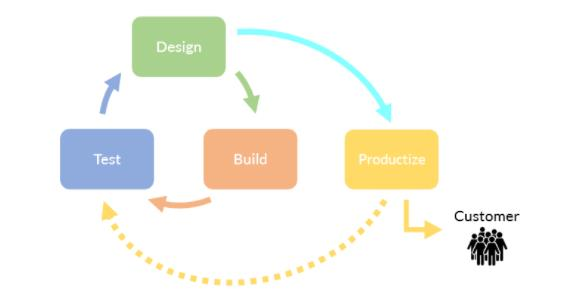
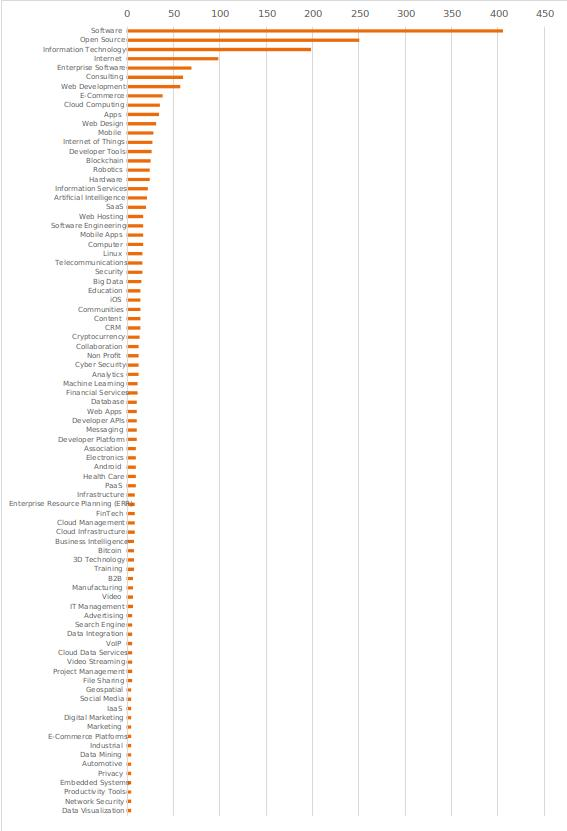

# 4. 案例研究分析，商业模型和命名法

## a. 简介

此最终报告的本章致力于利用附录中列出的命名法为关键 OSSH 项目提供定性分析，这些命名法定义了用于描述 OSSH 在个人、组织、部门和社会水平上的相关特征的关键变量和度量。来自这些案例研究的见解与对于 OSS 的影响的定量评估最终构成了得出政策建议的基础。

OSSH 是一个涵盖了源代码或者设计授权、合作管理、提供方式以及生产过程本身等方面的宽泛概念。如需理解 OSSH 在这些维度中的每一个上的影响，此报告致力于开发一种命名法系统，以及建议它同商业模型和经济影响之间的关系。

## b. 案例研究方法论

这些案例被通过嵌入式多重案例研究 (Yin 2003) 的形式加以研究。数据通过基于标准化访谈指导意见的半结构化、无确定目标的访谈而被收集。个别案例通过通用判据结构来评估，使其横向可比。这些案例随后被聚集到专注于政策决策制定者的视角的 SWOT 分析中。这些案例的选择基于它们对于欧洲经济的技术独立性、竞争性和创新的影响，如同访谈结果以及提供给专家研讨会的输入所提示的。

### 案例研究和访谈的选择

五项案例研究代表了与 OSSH 领域相关的行业领域的多样化集合。它们基于同 13 个相关项目中的关键人物的访谈（在某些案例中，一个项目可能拥有多次访谈）。所有受访者都是其不同领域中的杰出人物，他们全部乐于参与并且提供了有价值的见解。我们高度称赞他们的参与与合作。同样值得注意的是，正是 OSSH 的本质使得人们倾向于参与多个项目，于是每一位个人参与者被请求回答关于他们认为对于此研究最为相关的具体项目。对于访谈候选人的选择判据包括：

地理多样性：尽管大量候选人来自欧盟，也有受访者来自北美或者英国。

部门多样性：保证代表了商业、公共部门以及学术界的项目得到代表。

软硬件：受访者代表了硬件（叠层制造、电子和晶片）和软件（基础技术与最终用户技术）项目。

开放性多样性：受访者代表了从完全开放（根据使用下文所述方法进行评估）到提供基于开放技术但其本身属于封闭的私有产品的项目。

组织结构多样性：受访者代表了基金会、项目领导人、风投资本资助的企业、私人资助的企业、学术研究机构，以及政府赞助的实体等。

### 访谈的结构

这些访谈被编排为持续一小时，以及最多 30 分钟的延时。由于 Covid-19，它们全部采取视频会议的形式，并且这些通话被录制下来仅供内部使用。在每次通话之前，受访者被提供一份访谈模板以及一组解释性的注记（参见附录）。访谈同时包括定量问题（在此，受访者被请求提供关于 OSSH 对于不同因素的影响，以及不同因素对于 OSSH 的影响的主观数字评估）以及一系列能够给出更具推论性的答案的定性问题。

## c. 软件和硬件的开放性和硬件性的维度

软硬件开发通常包括涵盖了设计、建造、测试，以及根据测试的输出进行重新设计的循环。当一切就绪的时候，该循环的构建阶段切换到产品化。对于软件而言，所有这些阶段发生于数字领域。

产品化可能如同移除某些调试代码并且将二进制文件置于其可被下载的地方那样直接。它可能涉及以电子化方式打包产品（例如 Linux 容器镜像），或者可能涉及将二进制文件刷入设备的非易失性存储器。对于诸如汽车等物，尽管大部分设计可以以数字形式发生，众多部件在其被物理地制造之前不能被有效地测试，尽管一次性悬挂组件可以被单独加工，制造汽车将会涉及物理领域的大量操作，诸如制造夹具等。因此，此循环中的更多部分将会发生于模拟/物理领域。

### 硬件性

在每一个阶段，这些行为发生于数字（信息）领域和物理领域之间的光谱上的某处。例如关于软件，设计和构建发生于数字领域，而测试很可能也发生于数字领域，尽管本意是用于设备中的软件将会涉及将其加载到设备中。产品化很可能也位于数字领域之中。

现场可编程逻辑门阵列（FPGA）通过硬件描述语言（HDL）而被设计和构建。大部分测试将会发生于数字领域。有些测试以及产品化将会涉及物理领域中的某些行为（将比特流加载至装配于电路板上的 FPGA 之中）。对于特定应用集成电路（ASIC），设计和构建（利用模拟）以数字形式发生，而测试则可能涉及某些物理行为（如果 FPGA 被用于测试），但是产品化需要物理领域中的大量行为。

对于印制电路板（PCB），大部分设计和测试发生于数字领域，但是产品化基本上是物理的。

大多数称为工艺或者工匠的行为很可能基本上发生于这一尺度中的硬件端。将“软件”看作“信息性”可能会有所帮助：例如，即使某项设计有时是在纸上勾画出来，并且邮寄给其他人以得到评论，这仍然位于接近该尺度中的软件端的某处，由于被传递的是信息。如果某件产品横跨两个领域（例如包含固件的 PCB），其每一个组件可能拥有不同的硬件性等级。记住这一点，对于此循环中的设计、构建、测试和产品化阶段，硬件性可以在一个尺度上进行评估。

### 开放性

关于开放性的涵义的争论比开源本身还要久远。被广泛接受的是，开放技术和私有技术之间并没有非此即彼的二元区别。最为确定的方面是关于授权许可，由于关于什么是以及什么不是开源许可证已经有为人所接受的定义。然而，关于开放性的更为宽泛的上下文环境是关于合作、（再）分发以及以衍生作品的方式重用其结果。在此显而易见的是，股东仍然可以维持对于某项技术的严密控制，即使它是自由授权许可的。这显示了对于某项技术努力应该被看作多大程度地开放这一问题的答案的必要性。

为了评估开放性，我们评估了若干种现存方法，包括按规则开放模型以及 Waugh-Metcalfe 模型。按规则开放模型假设开放、精英领导的管理、基于规则的体系、合作性路线图的规划、独立贡献者的健康的社区、分叉的可能性以及总体透明性等等属于开放性的关键维度。Waugh-Metcalfe 模型则区分法律、标准、知识、管理和市场方面的开放性。

开放性的不同方面难以通过请求参与者基于某个尺度对其开放性进行评级而直接评估。与之相反，基于按规则开放模型和 Waugh-Metcalfe 模型的指标在访谈问题和案例研究结构中被间接、独立地评估。通过这种方法，对于每一个案例的开放性的总体评估通过聚合这些结果而实现。受访者从未被直接要求评估某一领域的开放性度量。

### 在生产过程中的定位

与硬件性分类学中的设计、构建、测试以及产品化相关，将某种基于软硬件的组合的产品引入市场的过程涉及在制造诸如板卡、部件和设备等物理产品的同时创造诸如软硬件设计等信息物品。基于这一点，关于技术的哪些东西属于开放这一问题可以分别针对设计过程和设计方法以及制造过程和生产方法而单独回答。必须注意到，在开放性和硬件性之间存在某种关系。

关于开放性和硬件性的方法通常随着生产过程而发生变化。例如，在设计阶段属于信息物品的自由授权许可的芯片设计可能被用于制造属于物理物品并且以市场价格销售的芯片。类似地，私有软件开发工具可以被用作设计并创造自由授权许可的软件产品的方式。通过独立评估设计过程、设计方法、制造过程以及制造方法的开放性，关于哪些东西是开放的问题可以被系统性地回答，并且开放性和硬件性之间的关系可以被确定。

由这种分解提供的一种有趣视角是，软件开发过程可以被看作这种在设计阶段以后结束的总体生产过程的一种特例。作为信息物品，软件通常并不导致制造阶段。然而在设计阶段过程中，它类似于硬件设计的开发，尤其是那些主要在数字领域被开发的软件。

这种关于生产过程的描述是一般化的。当前的视角不同于引入 OSSH 概念以前的，在此，四个方面中的任何一者的开放性现在成为可能。这提供了一种潜在的理论方法，它将私有和开放的产品和过程看作位于开放性的光谱和硬件性的光谱上，而非作出非此即彼的二元区分。

### 在市场部门，技术领域和工业领域的定位

欧洲经济包含众多预期将会受到 OSSH 特别影响的行业领域。这些领域包括能源、卫生、家庭自动化、航空航天、消费电子产品、娱乐、汽车、制造和物流等。技术发展预期将会驱动这些领域的变化，包括网络安全、计算、网络和软件基础设施、人工智能、高性能计算，以及测试和工具等方面的进展。这些案例定性地进一步探索了这些领域和技术进展的组合，以便潜在地识别出具体的兴趣领域。

### 关于技术开发的合作方面

OSSH 技术的开发在很大程度上依赖于健康的社区中的生产性合作。由单一实体开发 OSSH 技术的案例确实存在，但是它们并不普遍，并且并不代表创新的主要领域，尽管它们确实代表风投资本资助的相关领域。通常，社区合作在创新能力上胜过单一竞争者，与此同时通过研发投入的积累而减少个人参与者的成本。此报告的案例研究专注于社区开发的技术。

众多参与者通过逐渐延伸他们的参与而融入社区。个人参与者的这段从消费者到战略契约者的旅程以及组织对于社区的投入程度指示了 OSSH 的影响是能够实现的。

社区同样从没有正式结构的松散组织的团体发展成熟为具有有效的管理以及对于非正式和正式标准的影响的潜在复杂的生态系统。对社区的成熟性进行评估有助于理解社区可能对于相关行业部门或者领域的影响。

基金会在支持项目、提供行政管理支持、组织事务以及筹集资金等方面具有重要作用。基金会在此被理解为托管较大的组织中的众多个体 OSSH 项目的伞状组织。发展出了有效的基金会的领域可以被设想为对于技术发展拥有较大影响。

## d. 商业模型和价值主张

软硬件模块被聚集与合并于系统的系统中，直到它们最终形成面向消费者的产品。这条供应链中的每一个市场参与者为其客户提供一种价值主张。消费者将其于竞争者的主张相比较，并且选择一种他们认为提供了最佳价值的。这种简单的概念展示了在经济的上下文环境中，OSSH 的开发必须提供明确的市场价值以便说明投资的合理性。这将关注的焦点置于商品化的方法以及从社区开发到企业的知识转移。

### 产品和服务分类

应用于商业模型分析的方法将价值主张划分为产品和服务。产品被定义为其销售者有权贩卖并且以某种方式排除其他产品的物品。这包括物理物品和私有软件。服务可以通过提供该服务的实体并不拥有的物品或者产品而提供。它们通过互补产品或者垂直整合而代表了价值与产品的关系。它们通常根据可计费时间或者订阅基础而提供。产品可以基于它们的收益模型、物品类型及其相互区分的方面而分类。这一方法评估了物品如何产生价值，以及它们的特性如何对企业生命力以及公司所选的的管理模型造成影响。

与 OSSH 开发相关，物品的类型被建模于从基础技术或者未完成产品到面向消费者的技术或者完成的产品的光谱之上。同样的思想被呈现于软件栈的技术概念之中。将产品置于这种良好的光谱之上显示了包括选择开放或者私有开发模型的研发优先级。

区分被建模于从被消费者预期但是极少关注除非它们不存在的非区分性产品特性到决定购买决策的区分性产品特性的光谱之上。市场参与者基于其产品的区分性的方面制定关于内部开发（差异化）或者合作以及分配研发支出的决策。

对于收益模型的分析通常专注于为企业产生收益。在 OSSH 的上下文环境中，这一问题可以被更加一般性地提出为，企业如何通过使用和开发它而实现收益。这些收益可以被置于如同积累研发支出的成本节约到产生收益的专注于消费者的价值主张的光谱上。这种变数影响关于应用于开发过程、适用的知识产权权利（IPR）模型，以及企业生命力模型等方面的开放性或者独占性的决策。

### 由收益区分的产品类型空间

代表了收益模型、差异化方法以及产品类型的三个维度的组合创造了一种具有八个卦限的三维空间。每一个卦限代表了一个具有共同的产品特征以及一系列企业生命力策略的领域。例如，关于成本节约、非差异化，以及基础技术的卦限提供了 Linux 发行版和基于弱左版许可证的模块的空间。诸如关于收益产生、非差异化，以及消费者导向的卦限等等并不普遍适用于基于 OSSH 的企业策略。

一种特殊的案例被表现为既不专注于收益生成也不专注于成本节约，并且因此对于收益生成不感兴趣的价值主张。这些案例代表了通过诸如营销由被提供的 OSSH 技术辅助的商业服务等方式产生间接收益的企业。这对于平衡创新和市场竞争带来了特殊的管制挑战。

### 与公共基础设施之间的关系

OSSH 的总体影响的一个关键方面是它作为不同的复杂技术的可重用的基础或者构建模块的实用性。OSSH 创新通过“创新汤”而创造正面的溢出效应。它们辅助了诸如通讯或者学习等用于特定终端的方法，而无需制定其具体应用。它们并不歧视应用或者用户。它们解锁了那些如若不然就在经济上不可行的访问，诸如为欠发达或者在经济上贫困的地区提供软件。这意味着 OSSH 展示了普遍同基础设施相关联的属性。

一方面，这意味着这种基础设施类型的溢出的经济影响可能超过直接收益，但是被它掩盖了。另一方面，它提示了一种关于 OSSH 开发以及保障性的关键 OSSH 产品的生命力的公共利益。

### 关于开放性的争论

描述于这些不同的命名法之中的不同变数和度量试图为关于开放性的涵义的问题给出更加系统性的答案，通过独立地评估物品在其被授权时，以及它成为其输入的下一物品的授权许可以及开发模型的开放性。这种讨论由于自由和私有输入的组合普遍存在这一事实而变得复杂。例如，私有工具被普遍应用于创作 OSS。类似地，自由授权许可的三维打印机可以被用于创造商业销售的物品。这意味着关于应用于价值链的不同环节的开放性的命名法对于分离 OSSH 的影响而言是必要的。

## e. 业界领域案例研究和成功案例

### 从创客到制造商——过程创新

#### 简介、定位和领域描述

OSH 允许那些将诸如学术和创客运动等领域结合起来的技术的开发，并且在公民制造和工业领域之间提供桥梁，以使得每一方得益于另一方。此案例研究包括来自 Arduino、White Rabbit、MyriadRF 和 RepRap 等项目的输入。

Arduino 是一个微控制器家族。它们是简单的小型单板机，可以通过多种方式配置，以执行包括传感器记录、设备控制、IoT 接口等一系列任务。其硬件和固件都是开源的。White Rabbit 是一个欧洲核子研究中心（CERN）项目，最初是为了通过扩展以太网标准和协议而为发生于粒子物理领域中的事件提供高精度计时。这一家族的电子设备现在被应用于其他学术领域，以及诸如地震学和高频金融交易等领域。MyriadRF 是一个由软件定义的无线电技术家族，合并了开源电子器件、门件、固件和软件。RepRap 是一种三维打印技术，最初出现于学术界，值得注意的是，RepRap 打印机的众多部件本身是可以利用 RepRap 打印机打印的。在这种程度上，它是部分可自我复制的。

这些技术通常辅助了其他技术，或者使其成为可能。它们可能出现于多样化的领域：学术、制造、电子和研究等。通过提供对于该技术的稳定实现，它们提供了低摩擦开发平台，并且经常带来原始发起人从未预料到的好处。并没有被代表的占统治地位的市场或者组织部门：原始项目的开发和对它们的利用都能出现于广泛的领域之中。

此类技术的特性为它们的灵活性。在每一起案例中，该技术的初始开发者预期，这种灵活性最好是通过将此技术自由开放给他人而被利用。其驱动力是多样化的。White Rabbit，作为一个 CERN 项目，它之所以被开放，主要是由于该项目的发起者强烈感受到，公共资金应该带来对于公众平等可用的技术。他们还感受到，通过适当的授权许可，对于他们所使用的设计的任何改进本身同样将会对于公众开放，并且它们最终能够反馈初始项目。在此提到的每一个项目都是硬件和软件的结合（并且在 White Rabbit 和 MyriadRF 的案例中，类似软件的技术还包括 HDL 代码）。即使是在每一个项目内部，不同的社区也围绕每一个子项目相互合作。

这一领域的参与者背后存在着宽泛的资助模型。原始项目发起者得益于学术和科研资金，以及私营部门投资和政府基金。每一个项目背后的结构和生态系统各不相同，并且这意味着，作为一个整体的每一个项目的生态系统拥有不同的资助模型。在大多数情况下需要谨慎地将项目发起人同围绕该项目而出现的商业模型相区分。例如，RepRap 本身只有最小化的资助，但是它确实拥有一个采用并且商业化其设计的商业运营者的繁荣生态系统。

在每一个案例中，由于开放授权许可模型而被觉察到的厂商锁定的减少是该技术的采用的关键因素。这使得采用者感到舒适，既由于底层技术不会消失或者发生根本性的改变，又由于没有一位制造商将会突然提价。特别地，那些既在预算限制下运作，本身又具有好奇心以及在众多情况下拥有所需技能和特长的科研人员和学者，想要知道他们能否相对于现存的私有市场而言，更加高效和有效地自行生产该产品。在每一种案例中，都发现了超出该项目的发起人所预期的对于该项目的新的应用案例。开放性辅助了针对不同的应用案例重新提出设计方案。例如，当应用于开放设计时，加固一块电路板以供高温高湿环境下的使用在很大程度上变得更加简单与廉价，相对于请求私有制造商为该特别应用案例开发一种一次性的变体而言。

在众多情况下，产品本身的市场由于被众多参与者支持而多样化了。在每一种案例中，（至少是在理论上）消费者能够自行制造该产品。这在实践上是真实的，对于 RepRap 的大部分部件而言，并且众多最终用户选择求助于某位拥有一台现成的 RepRap 的朋友来自行制造大部分部件。他们也可以请求第三方三维打印公司来打印这些部件，使用创客空间的一台现成的三维打印机，或者从诸如 Prusa 等公司购买一台完整的 RepRap 打印机。这些选项创造了市场空间的多样性，并且潜在导致了供应上的弹性。类似地，对于 Arduino，尽管众多购买者选择自行从 Arduino 购买一块完整的板子，而与此同时，众多家庭用户可能发现自行组装一块 Arduino 电路板具有挑战性，对于他们而言，带上板子的设计并且使其通过数量越来越多的提供开关式电路板组装工具的公司中的一家快速、廉价与高效地制造出来在理论上是可能的。同样有由 Arduino 以外的公司制造和贩卖的与 Arduino 兼容的板子的繁荣生态系统。这提示了这样一种重要的区分因素，即消费者购买正牌 Arduino 板子是由于他们认为正牌板子相对于未知制造商的产品而言具有更高的质量标准。另一种因素可能是消费者想要认可 Arduino 附加于开放生态系统之上的价值（一种“感谢您”的形式）。值得注意的是，请求 Arduino 开发并且量产自定义设计的板子是可能的，并且在这些情况下，消费者选择 Arduino 既是由于所积累的技能和经验，也是由于 Arduino 本身正在发展同自己的分包商谈判具有竞争力的价格的能力。所有这些提示，与 Arduino 授权许可模型的开放本性相反，Arduino 依赖于对其商标知识产权的严格控制以维护这种商业模型。

特别有趣的是，不同的生态系统有可能围绕同一项目而合作。在某个项目包含硬件和软件，例如 RepRap 的情况下，具有不同动力学的不同生态系统可以围绕硬件部分和软件部分进行开发。对于 MyriadRF，有三种不同的社区：硬件、软件和门件。每一种不同的生态系统代表了不同的动力学以及不同的差异化机会。一种共性是“开源开发模型”，在此，参与者可以更改底层设计以应对某种特别问题或者需求，而这些可以随后反馈软件和门件领域的主要设计和功能，但是在纯硬件领域则不尽如此。换言之，硬件越“硬”，其设计和开发工作就越有可能以相同于私有开发者通过中心化研发操作，而非合作者社区所执行的方式而被最终执行。

这一领域中的技术可被用于宽泛的应用案例。它们并非交钥匙式的即用型消费者产品，而是普遍被用作更加复杂的系统的组件，或者用于研究和学术领域。

工具被认为是一个重大问题。在每一个案例中，用于设计、制造和测试该产品的 OSS 工具的相对缺乏被注释为对于开发的抑制因素。这一问题既适用于“硬”硬件（机械部件和电子器件），也适用于“较软”的硬件，诸如用于开发、测试、模拟和实例化门件的工具。在每一种案例中，参与者注意到这种情况正在得到改善，但是仍需进一步改进以降低参与的准入门槛。

没有任何参与者将网络安全看作在研发过程中特别重要的。然而，对于任何使用硅晶的项目，仍然留有关于底层的芯片可能从内部被攻陷的担忧。这对于那些可能被整合到通讯中的项目（诸如 MyriadRF）而言尤其是一种担忧。理论上，芯片可以被制造为带有隐藏的后门，它可以辅助解密信息，或者允许知道此后门的恶意第三方获得对于该设备的访问。相对于可以通过门件配置的通用目的芯片 FPGA 而言，对于特定应用的集成电路（在此，极难跟踪完整的供应链和开发链），这潜在地属于一种更为重大的问题。因此，开放门件潜在地提供了一条路径以增强安全性，通过允许仔细检查该代码，以及允许整合能够监测异常行为的代码，并且允许当此设备在现场时为其漏洞打补丁。因此，计算基础设施潜在地也受到这个开放硬件领域的影响。人工智能（AI）并未被认为特别受到此领域的影响。然而，这些因素的相关性和影响被预期在未来增加。

这一领域的技术当前对于大多数部门的研发只有较低或者最小化的影响，其大部分开发很可能见于企业部门。这在较小的程度上在公共学术和研究部门中也是真实的。这将会随着时间增长，尤其是对于公司。对于生产阶段的这些部门的影响也是如此。

#### 成功案例：Arduino

Arduino 项目展示了由欧洲的爱好者、创客和制造商运动所产生的需求能够如何扩展成为发展出了它自己的具有国际影响力的生态系统的成功制造企业的。

Arduino 包括一个微处理器家族，它可被用于从创客项目到学术再到工业的多种应用，既在研发领域也在量产过程中。该硬件本身基于一种知识共享：以相同方式分享许可证（CC BY-SA 4.0）授权，而软件则基于一种同样的互惠许可证（GPL）。这意味着硬件的设计（能够）被商业性或者非商业性地复制，因此对于 Arduino 的商标以及相关授权许可模型的控制对于维护企业价值，以及将这一名称同官方 Arduino 产品的质量和起源相联系起来是至关重要的。

Arduino 在商业市场内贩卖其板子系列。它还提供围绕其使用和开发的咨询服务，并且还在最近发起了一种付费的 SaaS 模型以辅助使用 Arduino 硬件进行的 IoT 开发。

Arduino 对于爱好者和创客的极低的准入门槛意味着众多人们具有对于这种平台的经验。这进而意味着众多创客成为了教师和教育者，而此生态系统变得能够自我维持。当具有这种经验的人们进入工业领域时，他们继续使用其所熟悉的平台，而这一点变得极具吸引力，由于避免了平台提供商的厂商锁定。尽管在实际上有着第三方硬件提供商，这并不是重大威胁，由于价格差别是最小化的，并且客户更加愿意购买正牌 Arduino 产品。所存在的主要区分因素包括由知识丰富的人们构成的现存生态系统，兼容的软硬件，以及由于没有锁定而带来的供应安全。

Arduino 板子可被用于需要简单处理和连接性的众多案例，包括学术、研究和制造等。一个日益增长的应用领域是 IoT，在此，具有灵活处理能力以及使用不同协议和频率的射频（RF）连接性的小型、低功耗设备是至关重要的。

在物理领域存在显著的因素影响，而包括 Arduino 等开放硬件项目受到这些因素以及那些适用于数字领域的因素影响。因此，用于回路研发的软件工具的存在性仍然滞后于软件方面的等价物。开源替代品（例如 KiCad）正在被开发，但是 OSH 工具的可用性仍然滞后于软件世界中的类似工具的可用性。这意味着较高的准入门槛，而它又意味着爱好者/创客市场发现这些工具不可获得，从而意味着具有关于这些产品的技能的工程师的较少积蓄。物理物品同样受到围绕运输的问题的影响（对于诸如电路板等小型设备，这并不是如此之高的运输成本，而是与跨境运输这些设备，以及某些国家的进口管制相关的问题）。管制和认证可能也有影响，这在短期内是不成比例的，因此尤其影响中小型企业。范例包括欧洲合格认证（EC，在欧盟）以及联邦通信委员会认证（在美国）。

网络安全是一个重要因素，并且随着时间推移日益重要。Arduino 设备也可能成为数字基础设施，特别是 IoT 领域的日益重要的组成部分。

Arduino 不太可能在某一工业或者社会部门拥有不成比例的影响，尽管从总体上看，在所有部门总体上可能会有重大积极效果，由于 Arduino 在基础设施，特别是 IoT 领域中的应用。这可能尤其对于中小型企业有利，它们将会看到它们对于这一市场的访问通过 Arduino 所带来的较低的准入门槛而增强。

Arduino 展示了基于开源基础提供一种简单的硬件平台能够如何使得对于技术的访问民主化（导致增加的公众参与，从爱好者和创客，到学者、研究人员，以及最后到达工业）。工业上的采用既受到对于该项技术知识丰富的个人的储备的可用性的激励，也受到，粗略地说，该项技术的开源本性提供了针对锁定的保护所带来的舒适性的激励，这使得 Arduino，作为一个相对小型的组织，能够在事实上同更加大型的企业竞争。

#### 同 OSSH 社区的整合

生态系统涵盖了广泛的活动范围。在垂直方向上，此生态系统可以划分为涵盖“硬”硬件、门件和固件/软件的片断。尽管相互依赖，每一个生态系统有其自身的特征和动力学。

与这种相互依赖的多重生态系统的建立相平行，还有相互依赖的社区的建立。最为良好建立起来的是那些运行于硬件项目的软件端，并且深度整合到其他相关社区之中的社区，诸如 Linux。

贡献机制从组织到组织，以及在组织内部从项目到项目而显著不同。关键的观察在于，硬件越“硬”，组织所进行的开发就越有可能采用传统开发方法。

生态系统是多样化的，包括制造商、设计者、爱好者和创客、学者，以及商业制造商。

Arduino、RepRap 和 White Rabbit 为硬件和软件采用了左版授权许可模型，尽管每一个项目都承认，可能会有更加包容型的授权许可模型可能更加适用的应用案例（例如，辅助同私有技术的接口）。Arduino 还可能为诸如教育等案例应用诸如具有非商业使用条件的许可证等非开源许可证。在每一种案例中，左版许可证被用于鼓励使用这些技术的实体发布它们对于底层技术作出的任何改进或者修改的设计材料。特别地，Arduino 利用其商标权作为区分它自己，以及在生态系统内部提升清晰性的机制。因此，使用“与 Arduino 兼容”这一短语是被鼓励的（如果这是真实的），而将一件非 Arduino 的产品描述为“Arduino”是被禁止的。

倾向于存在这样一种区分，在那些为软件和门件做贡献，可能是创客、爱好者以及其他个人的人们，以及那些参与诸如电子电路等更“硬”的硬件以及物理物品的开发，更加倾向于受企业指导的人们之间。个人开发者更有可能被留住，如果他们位于一个活跃的社区之中，因此在每一种案例中，社区外展是重要的。

一系列宽泛的方法被部署，从可在线获得的构建材料，到更具互动性和人际性的方法，诸如举办研讨会以及在世界各国的会议上作展示等。Arduino 还拥有为弱势群体个人捐赠材料的计划。

Arduino 直接向客户销售，并且就此而言是一家处理知识产权开发、社区开发和外展，以及销售的集成式实体。与之相反，White Rabbit 的设计被独立商业实体销售。CERN 本身对于知识传播更有兴趣，并且赋予商业实体使用该知识的自由，其目的是，每当可能时（例如，通过使用互惠授权许可），进一步生成的知识应该被它自己要求成为可用的。RepRap 可通过众多制造并且贩卖该设备的商业实体获得：例如 Prusa。也有正在成长的三维打印机农场，它们可以批量购买生产材料，由于这样做的理由增加了，即在此情况下，切换到量产技术（例如注塑）变得在成本上划算。

作为一家商业组织的 Arduino 将收益和赢利能力看作重要的事情，但是它同样热衷于看到技术不会停滞，而是继续以新颖的创新性的方式部署。RepRap 和 White Rabbit 可能对于后一条因素更感兴趣。RepRap 和 CERN（White Rabbit）热衷于看到其技术由诸如 Prusa（对于 RepRap 的案例）等商业实体的开发。MyriadRF 热衷于看到社区的成长，以及产生于该技术的日益增长的多样化项目。

#### 结论

欧盟拥有令人羡慕的项目，它们展示了开放授权许可和开放开发方法在带来一种从爱好者到研究人员和学者，再到制造商和经销商的多样化生态系统的能力。然而，知识产权中的监管以及缺乏明晰性可能会成为一种阻碍。移除这些障碍将会呈现一场显著的机会，如果采取了某种均衡的方式，并且来自美国和远东的威胁被适当地回应。

### 开放硬件计算和基础设施

#### 简介、定位和领域描述

这些项目被发起的目标是撬动开放和准开放硬件技术，以便为创新和商业开发提供平台。此案例研究考虑开放计算计划（OCP），RISC-V 和 SiFive。

开放计算计划由 Facebook 发起，以减少成本并且提升数据中心的效率，通过开发从服务器到数据存储再到机架和其他物理基础设施的部件。它涵盖了硬件和软件光谱，从最硬的硬件（机架和载具）到中间件（整合了由比特流配置的 FPGA 的网络交换机）再到软件（例如固件、接口和监控）。它的授权许可模型（对于硬件）并非完全开放。RISC-V 是一种用于微处理器核心的指令集架构，由加州大学伯克利分校开发，基于开源许可证发布，并且已经被实现于一些能够被实现于 FPGA 和特殊应用集成电路（ASIC）中的微处理器核心设计之中。这些设计中的某些可以基于开放许可证获得，例如 SWERV（由 Western Digital 开发）和来自 SiFive 的自由平台。SiFive 是本节的第三项案例研究，并且是一家积极的商业公司，由那些开发了 RISC-V 指令集架构（ISA）的个人在硅谷成立。它到 2020 年末已经吸引了 1 亿 2500 万美元的资金，并且生产了一系列处理器核心及相关产品，基于开源和私有许可证。

这些技术撬动了内在于利用开源授权许可进行研发分享的成本节约特性。开放硬件计算和基础设施计划寻求撬动标准化和合作研发的能力。技术的去私有化已经显示出了推动廉价商品化和标准化（由于传统提供商通过将其自家产品差异化为高于价值链而榨取价值）的基础设施技术客户同那些继续试图差异化其自家产品的传统基础设施技术提供商之间的紧张关系。RISC-V 和 SiFive 是这种生态系统中的主要参与者（就具有影响力的个人而言，这两家组织之间存在较大重叠），并且展示了为何非赢利和赢利的由风险投资（VC）资助的实体可以为了它们各自的利益、生态系统的利益，以及更为宽泛的经济的利益而合作。

开放计算计划基本上由会员订阅资助，占主导地位的是技术行业大手。其资金用于行政管理和外展。RISC-V 主要由会员订阅资助，并且在有限的程度上由活动赞助费资助。Si-V 是一家具有可观的资本投资的商业贸易实体。它的日常收益主要来自贩卖知识产权（例如，核心设计）和晶片。

这些项目的共同线索是，它们通过减少锁定而同私有技术相区分。对于开放计算计划的案例，其设计可被多家制造商实施，因此在每一种案例中，客户拥有关于他们所选择的硬件的厂商的潜在选择权，或者在极端情况下，可以安排使得硬件按照这些规范本身制造出来。RISC-V 基金会作为 RISC-V 指令集的管理实体。这意味着该指令集包含具有一致性的核心，以及可选（官方）扩展。宽泛地说，这意味着利用该指令集（以及官方扩展，如果他们愿意）编写运行于 RISC-V 核心的软件的任何人都能够由于他们的软件将会继续运行于来自不同厂商的不同芯片上而感到舒适。尽管并没有什么东西阻止某位核心开发者开发一种实施了其私有扩展的核心，对于锁定的恐惧将会抑制对于这些扩展的使用，这进而鼓励该扩展的开发者提交其扩展以整合至官方规范中。这种协同效应的典型是 SiFive，它本身广泛参与 RISC-V 指令集的开发。这种参与使得 SiFive 的客户，即使是那些使用 SiFive 的私有技术的客户，由于锁定的风险减少而感到舒适。

OCP 项目通常用于数据中心，但是也可用于数据中心以外的上下文环境，在此，类似的硬件特性（可被中心化管理和监控的能力；硬件可以被动态重新配置的能力；较低的环境影响和能源成本，以及容易利用来自多家厂商的同等硬件替换或者维修有缺陷的硬件等）可以被使用（例如，蜂窝基站）。RISC-V 处理器被用于日益增加的上下文环境。Western Digital 将其用于多种存储产品（嵌入式系统是一种流行的应用案例），但是指令集扩展允许将其用于矢量化处理的超算，以及诸如 Linux 等通用目的操作系统（例如在 BeagleV 中）。特别地，机动车技术正在它的路线图上。

OCP 对于它的硬件并不采用经典的开源风格开发模型。它并未被开放开发，并且其设计通常被呈现为完整的设计，尽管改进可以被反馈至原始设计者。与之相反，由 OCP 开发的软件以一种更具参与性的方式在 GitHub 上开发（并且基于完全开源的许可证）。基于此原因，尽管工具被 OCP 注释为一个重要因素，它的开放性则不是。运输对于诸如服务器机架等大型物理硬件的成功是重要因素，但是对于诸如硅晶芯片等小件物品来说重要性极小，而对于软件和门件则不相关。OCP 注意到诸如设计思考（即通过用户而非厂商的视角开发设计）等人力因素是至关重要的，而所有项目都注意到了社区的重要性。OCP 注意到与循环经济相耦合的环境思考的日益普及对于该项目的成功至关重要，并且使其会员公司和业务需求及其被看作良好合作公民的愿望与此保持一致。当前，晶片开发的障碍之一是对于晶圆代工厂的访问，以及准备某种 ASIC 用于制造所涉及的成本。为了提高成本效率，有必要进行大量生产，而这成为了中小型企业访问市场的一种障碍。

网络安全对于此领域中的所有受访者都具有显著的重要性。一种特别的关注是关于晶片的安全性，以及芯片包含由供应链中的不良参与者嵌入的后门或者恶意软件的可能性。开发并维护贯穿整个供应链的信任根的能力由于开放软硬件而得到了辅助。这种影响将会随着时间而增加。

这些技术预期将会显著影响所有基础设施，并且越来越如此。

AI 将会受到该领域的技术的显著影响，并且越来越如此，出于不同的原因。OCP 倾向于专著于构建数据中心所必需的技术，这些数据中心将会为 AI 技术的高级部署提供必需的数据和计算能力，在此，具有可能的扩展的 RISC-V 可以提供核心处理能力。这有可能带来重大并且与日俱增的影响。关于高性能计算的回应与此类似，基于相似的原因。

环境已经受到了这些技术的发展的积极影响，预期这种影响仍将显著增加。

所有领域受到这些技术的影响，同时与研究、开发和生产相关联，并且这种影响很可能在未来显著增加。所有领域都被直接或者间接代表，并且潜在地拥有可供发挥的显著作用。

#### 成功案例：RISC-V 和 SiFive

RISC-V 和 SiFive 的合并显示了一家基于来自学术研究的技术的 OSH 基金会与一家定位于从资本市场获取资金的商业实体的合并的威力。此外，RISC-V 基金会将其总部移至欧洲自由贸易联盟（EFTA）国家瑞士。

所有微处理器（CPU）需要指令集以决定它们如何运行和工作。RISC-V 指令集基于包容型 BSD 许可证自由可用，使其可以被任何类型的组织实现，而只有最小化的阻力，不论商业性或者非商业性。这意味着实现者可以自由选择它们自己的授权许可模型，并且有不同的模型被使用。有些此类实现本身是开源的，诸如 Western Digital 的 SweRV 核心和 SiFive 的自由核心，全部基于包容型开源许可证发布。SiFive 也生产使用 RISC-V ISA 的私有技术。它的收益模型涉及授权许可它的私有知识产权、贩卖晶片，以及出售咨询服务。

RISC-V 和 SiFive 是同一生态系统中的两家关键参与者，以 SiFive（和其他一些实体）为首，积极贡献 RISC-V ISA 及其扩展的开发，以提供一种稳定的标准平台，而与此同时，SiFive 使用这些标准来直接或者间接开发并商业化知识产权。SiFive 还积极参与围绕 RISC-V 核心技术（与 ISA 规范相对立）的开源社区，这使得人们更容易在实践中抓住 RISC-V 技术，这随后提供了能够继续在 RISC-V 生态系统中工作的训练有素而知识丰富的个人的基础。

RISC-V 的 92% 的资助来自会员订阅，而 8% 来自活动赞助费。它的开销涵盖了行政管理、外展（营销、活动管理和推广），以及 RISC-V 技术作品的开发。Si-V 是一家具有可观的资本投资的商业贸易实体。它的日常收益主要来自于贩卖知识产权（例如核心设计）和晶片。它的主要开销用于研发，以及特别是工程。

SiFive 和 RISC-V 通过提供一种被认为是不受危险的锁定效应影响的技术平台而将它们自己同其他东西区分开来。与软硬件世界中的众多其他开源项目共同拥有的特点是，它们降低了该技术的准入门槛，而与此同时为在商业上下文环境中使用该技术的人们提供了一种舒适感，由于它们的实现将会持续存在并且被支持，由于在极端情况下，客户能够拿着开放设计，要么自行继续对其的支持，要么通过另一家商业合作伙伴寻求这种支持。

SiFive 核心能够在横跨宽泛领域的众多应用中被找到，从 IoT 设备到系统芯片设计，再到近期出现的能够运行桌面操作系统的处理器。

工具仍然是研发和开发阶段的问题，如同设计的实现的可用性和质量。物流相对次要（其产品要么是知识产权或者咨询服务——在此物流是不相关的，要么是硅晶芯片，它们在物理上很小）。知识产权限制，尤其是专利，可能会成为问题。RISC-V 的本意是尽可能不受专利打击的影响，而为自由核心选择包容型许可证反映了这一点。人力和设计因素是重要的：RISC-V ISA 被设计为了合理地简单直白，并且与学生和其他人可能已经熟悉的其他 ISA 的结构保持一致，因此即使他们并未接触过 RISC-V，这一学习过程很可能相对快速。就此而言的一个特别重要的因素是作为非赢利实体的 RISC-V 基金会与作为商业实体的 SiFive 之间的互动。

网络安全从软硬件视角来看都是重要的，基础设施技术的影响也是重要的，并且越来越如此。

AI 可能是 RISC-V ISA 的灵活性和可复制性以及由此导致的 SiFive 晶片的相关性增加的一个领域。这很可能会随着在诸如矢量数学和张量指令等领域的对于 ISA 的领域特定扩展的采用而增加。然而，在高性能计算的上下文环境中，对于该技术的采用的一种阻碍是，大多数现存的知识产权受到高度保护，因此不能通过开源实现处理。

有一些围绕 RISC-V 的倡议，既为了生产低功耗芯片，又为了最大化高性能计算的效率，以能够达到每瓦功耗的最大每秒浮点运算次数（FLOPS）。

RISC-V 和 SiFive 产品很可能对于个人拥有重大影响，尤其是对那些参与研究的个人。当前，它在公司中的影响相对于 ASIC 而言更多地围绕 FPGA，并且这一趋势很可能继续下去，随着 FPGA 变得更加重要。接口和指令标准化对于 RISC-V 技术的采用而言是一个重要因素，并且很可能仍将如此。对于公共部门的影响可能特别与数字主权和自治的利益相关。一个范例是由金奈（马德拉斯）印度理工学院开发的 Shakti 核心。这是一种基于 RISC-V 技术的开源核心，其目标是保证印度的计算能力，包括用于军事与核能开发的计算能力继续可用，并且能够进一步发展，如果其他国家限制对于它们的技术的供应。

SiFive 展示了一家商业公司可以成功筹集一亿美元数量级的资金以开发 OSH 技术，并且这种活动的成功依赖于 SiFive 和 RISC-V 基金会以及更为宽广的世界之间的高度协同关系。

尽管 RISC-V 基金会本身迁移至 EFTA 国家（瑞士），SiFive 仍然位于美国硅谷，由于包括集资环境等原因。

#### 同 OSSH 社区的整合

此处研究的两种核心生态系统当前几乎没有重叠。OCP 包含那些对于开发和标准化数据中心组件以减少总体成本感兴趣，以及那些希望实现这些设计的组织。RISC-V 生态系统包含 RISC-V ISA 的实现者，再加上 RISC-V 基金会以及其他组织，诸如开放硬件小组，其存在是为了撬动此技术，以及用于接口、协议和系统的通用硬件（CHIPS）联盟（Linux 基金会的一个项目）。也有围绕开源工具链，例如覆盖了硬件描述语言的工具链的开发而联合的其他相关生态系统。

SiFive 本身和 RISC-V 基金会深度整合，很多参与 RISC-V ISA 的初始开发的人们仍然同时参与两个组织。两个组织都高度参与外展和开发，并且 SiFive 是诸如 CHIPS 联盟之类的组织的会员。

SiFive 是 RISC-V ISA 和它自己的芯片设计的核心贡献者。OCP 很少承担考虑到硬件的合作设计，并且在这种程度上，设计基本上是作为完整的设计而提交到 OCP，它们可能随后由一组选定的测试者进行 beta 测试，随后将其评注反馈给原始设计组织。然而，软件是在很大程度上基于 OSS 开发方法开发的，并且发生在 GitHub 上。

在每一种案例中，生态系统的中枢是一家组织（RISC-V 基金会或者开放计算计划基金会），它在根本上作为每一个项目的核心知识产权权利的保管者。对于 RISC-V 的案例，这是 ISA，而对于 OCP 的案例则是不同的硬件、软件和接口设计。除了保管者的作用以外，它们还提供协调、外展和行政管理中枢的作用。核心知识产权权利的稳定性对于每一个项目的成功至关重要，并且在这种程度上，这些基金会实现了事实上的标准化实体的作用，并且允许行政管理结构中的开放性。

RISC-V 基于最小限制性的 BSD 许可证可用，但是使用该 ISA 实现的核心基于一系列宽泛的不同许可证发布，从包容型的到私有的。值得注意的是，旨在大量实现的开源 RISC-V 核心最有可能基于某种包容型许可证发布。这是由于（觉察到的）为门件应用左版/互惠型许可证的复杂性，以及觉察到的同那些由私有工具链引进的众多知识产权区块和其他组件基于它们发布的私有许可证的不兼容性。由 OCP 发布的软硬件基于一系列不同的许可证，其硬件基于由 OCP 本身起草的两种许可证（包容型和互惠型/左版）之一发布。值得注意的是，它们很可能与其被描述为开源许可证，不如被描述为标准许可证，如果仅有的完全授权的实现是那些忠实遵循原始授权人的设计的实现。

OCP 和 RISC-V 依赖于企业会员的贡献。特别地，只要考虑到硬件，很少有个人输入。然而，围绕软件而联合起来的社区确实倾向于变得更为多样化。RISC-V 寻求以身作则，并且通过鼓励其会员参与其他项目而进行领导，即寻求将项目贡献建立为一种行业范式。RISC-V 还相信，贡献的愿望背后的人力因素是，他们的项目是引人入胜并且能够得到回报的。有些工程师想要将他们的贡献用作平台以展示他们的工程技能，但是这在软件或者诸如门件（核心）等更像软件的硬件领域中最为显著。

每一个案例中，大量努力和开销被部署于教育以及使得相关设计和素材可用。这些包括 wiki、会员门户、GitHub、讨论论坛、入门教程、教科书、专业培训合作伙伴、在线学习、研讨会、见面会等。

OCP 的主要目标是使其设计在商业上下文环境中发挥作用，以某种为该技术的用户带来成本节约和效率提升的方式。使用 OCP 技术的本意是影响用户的底线，但是通过减少开销而非增加收入的方式。这（在某种程度上）对于 RISC-V 也是真实的，但是作为一个快速发展的技术领域，RISC-V 更有可能发现它自己被部署于本身就是利润生成器的新应用中。

SiFive 的核心度量是增加股东价值，但是在此之内，诸如设计上的成功以及采用率等度量也是重要的。总体来看，它将其看作总体部署的核心的一部分的 SiFive 核心的数量是巨大的。另一个因素是见证技术上的核心作为赋能者的出现，以及来自于利用它的学术界的新技术的出现。后一种度量也和 RISC-V 基金会相关，关于全部类型的 RISC-V 核心。

#### 结论

欧盟/EFTA 境内的若干所学术卓越中心（博洛尼亚大学、西班牙巴塞罗那国家超算中心、苏黎世联邦理工学院等）以及开发和利用这一领域的中小型企业的存在是一项巨大优势。然而，尽管有着 RISC-V 基金会迁移至瑞士这一积极步伐，以及主要是基于欧盟的自由和开源晶片（FOSSi）基金会的存在，大多数关于开放硬件的合作仍然由美国协调。朝向由软件定义的基础设施的迁移为欧洲带来了重大机遇，以联合它在这一领域的技能和商业活动，如果它能够开发出一种不那么回避风险的商业环境，以使得它能够维持企业和创业者被吸引寻求司法管辖区中的资本，它们拥有对于围绕开放技术的商业的更为深刻的理解，并且拥有对于推广它们的资本的访问。除了关注美国（主要是硅谷、大波士顿地区，以及北卡罗莱纳研究三角区）以外，欧盟还应该认识到来自英国和远东地区，尤其是中国的竞争。

### 最终用户应用程序

#### 简介、定位和领域描述

专注于消费者或者最终用户的应用程序代表了这样一种领域，在此，由于软件的普遍自由和企业对于差异化的需求之间的内在冲突，切实可行的商业模型的开发极具挑战性。此案例研究基于来自 CentOS、LibreOffice、Nextcloud 和 OW2 的输入。

由社区驱动的 CentOS 项目带来了一种来自 Red Hat 的 Linux 平台，它被广泛用作嵌入式系统的基础。LibreOffice 是文档基金会开发的一种办公套件。Nextcloud 是一种专注于安全和隐私的本地部署的内容合作平台。OW2 为企业信息系统开发基础设施软件。

消费者的需求通过专注于产品的中小型企业、服务提供商，以及由社区管理的非赢利组织的组合而得到满足。欧洲的大型公司很少代表主要的开源项目。参与者通常出于自身利益而将企业与社区或者政治活动相结合。

一系列宽泛的开源项目至少是在部分程度上针对消费者或者最终用户，包括常见 Linux 发行版中包含的大部分软件。开发者的主要兴趣在于寻求他们的产品的采用。除了利润动机以外，它还可以通过朝向构建开放标准、支持诸如少数民族语言等多样化需求的能力，或者减少采用技术的障碍等驱动力而激励。其结果是参与者的宽泛多样性，从社区组织到初创公司。

支持消费者的欧洲开源企业的特征是通过收益实现自我资助的中小型企业。它们可能被嵌入于产品特定的贡献者社区，由企业提供规划和稳定性以使得社区能够进行创新。人员成本占有开销的最大份额。云计算和营销成本也是重要的。非赢利组织通过会员费、捐助，以及来自会议或者商品的收益而得到资助。实物贡献，例如硬件或者云基础设施的捐赠也是常见的。社区组织有时会资助某些类型的活动，诸如用户体验设计或者在大众生产过程中并未得到良好贡献的文档。

软件基于开源许可证而成为自由的这一事实是一种关键的区分因素。它辅助了对于非预期的应用案例的探索，并且在嵌入式系统的案例中减少了厂商锁定，或者保持消费者能够控制他们的数据和隐私。有些消费者基于他们的股东的强制要求而决定技术，例如如果他们强制要求数据以公开标准化的格式保存。开放政务也可作为一种区分因素，其中，由某个得到认可的社区组织以某种同行评审方式而开发的开源产品优于只是源代码在某个开发平台上的可用性。这特别地使得业界合作成为可能，在此，开放政务可能同样是出于有利于竞争力的原因的一项要求。

消费者位于一条关于付费意愿的宽泛的光谱上。开源产品利用极小的经济手段促进了用户的采用，但是也会与服务订阅共同使用。它们同样迎合了消费者的由非经济原因驱动的需求，例如那些倾向于用于教学的开放技术的制造者或者教育机构。

开源产品的研发最有可能受到人力和设计因素，以及工具和部件的可用性的影响。在生产过程中，部件和工具的可用性，以及人力因素仍然是一种担忧。

在今天，参与者将研发过程中的计算基础设施和网络安全看作是重要的，并且预期环境方面和计算基础设施在未来的重要性增加。在生产过程中，计算基础设施和网络安全也被看作重要的，而环境方面的考虑在未来的重要性将会增加。

在研发阶段，个人、公司或者组织、公共部门实体、业界代表，以及欧盟本身的影响在今天被认为是基本平衡的。公司或者组织的相对影响预期将会增长。开源的生产性应用被看作由公司或者组织以及公共部门实体驱动，其中公司或者组织的重要性未来将会增加。

#### 成功案例：Nextcloud

Nextcloud 是开源最终用户应用程序领域的一个特别成功的案例。它允许用户在计算机、移动设备和云之间同步数据。到 2020 年，Nextcloud 是最为广泛部署开源内容合作平台。它被同样以欧洲为中心的 KDE 社区作为 ownCloud 而概念化并孵化，其目标为提升用户对于他们的云存储的数据的控制。其后，ownCloud 收到了风险投资，在其开发者社区与投资人之间发生了冲突。在其所导致的分裂中，Nextcloud 被以这样一种管理模型创建了起来，它更加紧密地面向商业和志愿者社区的生命力。Nextcloud 基于 AGPL 3.0 许可证，并且并不要求签署贡献者授权许可协议。

自 2016 年成立开始，Nextcloud 展示出了企业客户订阅、雇员和收益的年复一年的持续增长。在 2020 年其收益超过 800 万欧元。Nextcloud 主要从欧洲联盟委员会得到资金以开发尊重隐私的搜索功能，作为下一代互联网（NGI）计划的一部分。

Nextcloud 是一种可以由垂直集成商本地部署为一种预配置的应用程序，或者基于由用户运行的云硬件而部署的内容合作平台。不像竞争对手提供的产品，Nextcloud 并不运行某种基于被托管的用户数据的分析或者广告平台。用户赞赏对于他们的数据的隐私和安全的更多控制。

这种对于安全和隐私的专注使得一些如若不然就不能被很好地提供的应用案例成为可能。大型大学利用它来为其学生提供合作平台。法国和德国的公共广播电台和政府部门部署了它。企业利用它分享敏感数据或者实施策略以保持公司信息远离公有云平台。基于开源许可证的完整源代码的可用性辅助了安全性，并且符合审计要求，同时保证了为更大规模 Nextcloud 部署进行投资的组织的长期运营自由。

将 Nextcloud 作为产品进行开发的大多数输入因素已经具备。该公司强调人力因素的重要性，尤其是工程技能和创造性，同时还有法律和管制环境。

网络安全，包括数据隐私，属于关键利益。管制环境对于保护用户隐私与企业或者公众进行用户数据分析的利益之间的平衡至关重要。作为中立平台运行的通用目的计算基础设施的可用性被认为是一种重要的基础。

由 Nextcloud 提供的创新影响了整个板块的股东。企业当前是最大的用户群组。它还将爱好者和个人的采用看作自托管的家用平台。政府和公共部门日益由于隐私专注和保护公民数据的公共强制要求之间的匹配而采用它。

Nextcloud 是欧洲开源企业的原型——一种产生于欧洲开源社区的创新性制造，并且将其自身同社区和用户价值看齐的自我资助的中小型企业。其构建于贡献者以及公司对于开发者社区的支持性作用之间的对称性的社区管理模型的可持续性是一种开源企业的作用模型。

#### 同 OSSH 社区的整合

面向消费者的开源开发被看作一种驱动技术创新的相对可持续的方式。特别地，这允许它迎合少数群体的利益以及非经济刺激，同时反制 IT 平台的中心化倾向。

总体来看，不同的参与者深度整合至开源生态系统。项目作为全球上下游网络的一部分而彼此基于其他项目的解决方案而构建起来。有些项目明确地致力于构建一种强调开源管理并且允许进入市场的欧洲生态子系统。尽管并未直接以它们为目标，这被认为是能够与居于统治地位的美国互联网公司进行竞争的一种方式。

大多数项目围绕中小型企业或者被联合构成了项目社区的偶尔贡献者的网络围绕并支持的核心贡献者小组而构建。在此环境中，非赢利组织所享有的良好声誉基于紧密匹配组织的管理以及对于社区参与的激励。

对于那些要求管理除了关于代码的简单合作以外的事情的项目，该开源项目的管理和行政实体一般是一家基金会或者企业。基金会，包括欧洲的基金会，托管项目并且提供行政、法律和金融支持。这推广了具有良好信用和开放管理的开源文件夹。位于欧洲基金会的众多项目由中小型企业驱动。企业围绕产品构建和采纳社区，实现一种微妙的平衡以基于社区工作产生商业价值。成功的模型已经涌现于基金会和企业驱动的场景。

开源授权许可的概念将基于版权的代码所有权同当前贡献者的社区对于该项目的管理权分离开来。这种分离对于提供自定义、运营和其他开源产品互补服务的服务提供商来说是一种特性。提供此类服务并不要求获得版权持有人的许可，或者同他们进行谈判，从而鼓励了开源服务子领域中的竞争。对于开源厂商而言，所有权和管理权的分离带来了特别的问题，关于如何使得它们自己在客户眼中差异化。由于如若不然就没有开源生产者和消费者之间的内在联系，该软件本身倾向于快速商业化。尤其是云服务提供商的垂直集成将大部分附加价值分配给了并不必然对该产品作出了贡献的服务提供商。诸如 GNU AGPL 等许可证通过将云托管看作软件分发从而触发遵守许可证的义务而应对了这一问题。

所有项目都报道了其在吸引和维持贡献者以及产生社区贡献中遇到困难。大多数项目显示，只有少数贡献者坚守了较长的时间。企业通过雇佣核心贡献者作为回应。今天，大部分贡献来自于有薪开发者和商业生态系统。社区倾向于将多样性和包容性看作是尽可能具有吸引力的，以便维持一种公平性、透明性和可持续性的声誉。

在成为开源贡献者的过程中存在陡峭的学习曲线。项目认识到了这一点并且为高中生提供指导甚至暑期计划。这种对于知识转移的专注强调了对于更多引入第三级教育的基于开源的教育的需求。尽管并非主要专注于职业相关技能，它传授了技术基础并且使得未来的发明者成为可能。

在专注于最终用户的应用程序中，商业化并非主要考虑。由企业驱动的项目将商业化留给了它们。社区组织鼓励并且依赖于互补性的服务提供商。

项目根据明确的判据衡量成功。它们特别地将社区的规模和对于代码基础的贡献数量看作社区健康度的指标。除了这些明确的判据，大多数参与者提到了额外的目标，诸如使得生态系统向用户的期望或者为社会的进步作出贡献看齐。显而易见的是，如果没有这些理想主义的目标，开源生态系统将不那么具有创新性和包容性。

#### 结论

开发针对消费者或者最终用户的应用程序为开源社区带来了一种特别的挑战，由于底层的利他主义和利己主义的混合。它由良好整合至全球上下游网络的可存活、多样化与创新性的中小型企业生态系统支撑。然而，尤其是大型企业让然经常在除了软件以外的其他领域进行创新。这限制了对于开源的投资，进而限制了开源消费者应用程序的市场影响。

### 嵌入式系统和 IoT

#### 简介、定位和领域描述

嵌入通用目的计算机的物理设备已经变得流行，从智能电话到剪草机和汽车。它们中的很多是利用开源部件创造出来的。现货供应的硬件之间增加的价格竞争以及自由授权许可的软件导致了对于消费者的更低价格，但是同时威胁到了定制软硬件解决方案的市场地位，并且侵蚀了诸如电信等知识产权权利受到保护的领域。此案例研究使用了来自 CentOS、OCP、SiFive 和 Yocto 的输入。

由社区驱动的 CentOS 项目带来了一种来自 Red Hat 的 Linux 平台，它被广泛用作嵌入式系统的基础。OCP 开发了高效、灵活和可放大的标准化硬件组件。SiFive 是一家开发基于开放硬件设计的领域特定芯片的公司。

不同类型的物理设备中的创新日益由软件驱动。这被朝向自动驾驶的趋势而高亮显示出来，在此，车辆看起来熟悉，但是通过嵌入式计算机系统和 AI 的应用而得到了新功能。由于这一点，将具有通用目的或者实时操作系统的计算机嵌入设备之中的任务变得显而易见。这使得嵌入式 OSSH 系统对于信息及通信技术（ICT）领域至关重要。

对于嵌入式系统的输入是计算设备和软件平台的选择。二者加起来使得该设备的用户可见的功能成为可能。CentOS 和 Yocto 为底层硬件配置自定义的基于 Linux 的软件平台提供了方式。这种可配置的软件平台的可用性允许设备开发者专注于差异化的功能而非基础。Linux 已经成为了占统治地位的通用计算目的操作系统。私有操作系统仍然被用于诸如实时应用案例等。

硬件组件同样日益标准化，并且被认为是一种商品。参与者期待对于开放硬件设计的增长的兴趣，其动机为降低成本，包括减少组件的老旧化并且增加它们的生命周期。与此同时，开放硬件芯片设计和指令集的可用性简化了定制晶片的开发，降低了成本和能耗。除了成本以外，OSS 平台和开放硬件的结合也被看作嵌入式系统市场中的更为高效的创新方式。

嵌入式软件平台被以这样的方式资助和管理，以保证没有任何单一的实体能够拥有对于该项目的过度影响。Yocto 由 Linux 基金会托管。CentOS 同 Red Hat 保持紧密合作伙伴关系，它所基于的产品来自后者。众多贡献者实质上采取托管软件开发基础设施或者捐赠由大学或者企业提供的网络带宽等形式。这对应着开销结构，在此，计算基础设施的成本占主导地位。人员费用被保持较低水平，由于项目很少付给直接贡献者或者职员薪金，而是依赖于社区来支持他们。

开放硬件项目主要由业界驱动，由于它们能够保证在成本节约与供应商竞争方面的具体好处。OCP 于 2009 年由 Fackbook 发起，以便为其自己的数据中心节约成本并且提升效率。SiFive 是一家依赖于 RISC-V 指令集的企业。

用户决定使用开放硬件设计和开源嵌入式软件平台是由于这样一种组合使其在能够专注于其产品的特性之前减少成本以及实现基本功能的开销。他们通过软件配置和许可证管理的最佳时间获益。这些方面中的大多数是重复性以及非差异化的。标准化软硬件组件简化了雇佣和合同管理。

开放硬件组件的商品化由大型工业消费者推动。在开发标准化组件的规范之后，供应商能够参与价格竞争。这减少了毫无意义的差异化并且增加了单个组件的生命周期。它与标准化软件平台的组合为嵌入式系统提供了必要的构建模块。

人力因素、法律和管制环境，以及工具的可用性是研发阶段的主要关注。相对于商业供应，用于开放硬件设计的开源工具尤其欠缺。在生产阶段，工具和人力因素仍是关注要点。对于嵌入式软件平台项目，生产性的应用主要是用户的责任。

网络安全、计算基础设施和 AI 是构建嵌入式系统时的特别兴趣领域。AI 应用程序为嵌入式系统提出了更高的性能要求。这些方面的重要性预期在未来增加。

对于个人而言，股东的影响是最大的，由于嵌入式设备、具有市场影响力的企业以及特殊行业子领域的普遍性，在此，现存的定制软硬件系统被替换为通用目的设备。这特别地改变了供应链的本性，在此，创新从提供黑盒子解决方案的供应商那里转移到开放硬件规范和软件平台被开发的地方。

#### 成功案例：Yocto

Yocto 项目开发了一种用于为特别是嵌入式系统等设备构建定制 Linux 发行版的环境。它被用于为一条宽泛光谱上的设备创造环境，从爱好者所使用的 Raspberry Pi 到立方卫星。

Yocto 是宣布于 2010 年的非赢利型 Linux 基金会合作项目。它起源自位于伦敦的初创企业 OpenedHand，它于 2008 年被 Intel 收购。它为开发者提供了带有开发工具和参考平台的嵌入式和 IoT 设备。它被广泛采用为嵌入式系统的基本平台，包括基于它而构建的 Automotive Grade Linux。

由于被组织为一种典型的由业界领导的开源社区，Yocto 通过会员费得到资助。它提供合作平台，其主要开销为系统管理、计算基础设施，以及非常精简的职员。该项目并不产生直接收益。对于项目代码的直接贡献由贡献实体资助。

成为中立合作平台对于允许如若不然就会竞争的设备制造商的参与是至关重要的。这延伸到了提供独立开发和集成环境。贡献并参与 Yocto 被认为是最佳实践。随后，Yocto 为参与公司提供临界规模、最先进技术的质量、许可证管理以及规模效率。

用户基于 Yocto 构建产品。这被一种逐级增加功能的层级方式支持。有些晶片厂商直接为 Yocto 项目贡献硬件支持层。设备配置被赋予版本号，并且在较大程度上可重现，这对于系统工程而言是至关重要的。

Yocto 项目专注于操作系统平台的开发，并且将其对于具体应用案例的采用留给平台用户。这由层级开发方式支持。开发过程的重要输入因素包括工具、人力因素以及知识产权权利框架。工具为构建系统镜像特定设备的构建过程提供了特征性的自动化。参与这种开发过程的要求极高，它使得人力因素变得非常重要。该项目警告用户“您需要成为一位良好的程序员，或者愿意成为这样一位”[^2]。由于 Yocto 构建过程将大量常见开源软件包整合至一种集成式系统中，它高度依赖于总体开源授权许可以及许可证的遵守机制。

作为广泛用于业界的平台，Yocto 拥有放大网络安全问题的潜在可能，使得对于网络安全的关注变得极其重要。计算基础设施的可用性对于该项目的运行至关重要。在未来，该项目将环境考虑预期为高度重要的，同时考虑爆炸式增长的嵌入式和 IoT 设备的总体数量。

该项目预期在未来影响不同的股东。个人依赖它以便为爱好者和商业设备提供稳定且安全的底层平台。企业利用它构建其产品并且依赖它。随着某些计算和互联网功能获得实用特性，Yocto 项目还将开始影响公共部门。它日益运行关键软件和网络基础设施。

Yocto 项目展示了潜在的开源创新，通过展示随之而来的在厂商中立的组织中的非差异化功能的合作开发。它还为所有股东的参与提供了机会。它认为重要的是，不要将开发者的创造性淹没于繁文缛节之中，以及不要表现得过于命令式。通过这一点，它在创造该项目的私人企业的利益同安全性和可持续性的社会利益之间架起了桥梁。

#### 同 OSSH 社区的整合

受访者所感受到的嵌入式系统市场中的 OSSH 生态系统发生的重要变化之一是产品的所有权和功能的分离。它限制了有计划的淘汰和用于营销需求的特性的增加。它同时创造了在制造商结束支持以后由消费者更新设备的可能性。这减少了环境影响并且增强了可持续性。即使是先前更加专业化的数据中心硬件也开始廉价商品化。

软硬件通常同步发展，特别是在操作系统层级。开放硬件和 OSS 的组合减少了为某一特定应用定制二者的成本。嵌入式系统市场中的合作门槛高于更广泛的开源社区的平均值。操作系统软件的开发过程复杂，并且通常要求对于预生产的硬件的访问。然而，CentOS 和 Yocto 紧密地整合于开源生态系统中。

对于开放硬件项目，参与所需的投资甚至更高。开发由业界股东或者与社区基金会相关联的学者进行，并且更多地依赖于诸如指令集等标准。

贡献过程反映了这种复杂性。不像 OSS 开发，基于底层工作创造单独授权许可的衍生物的想法对于硬件而言并不十分普遍。

即使他们的贡献过程被定制为他们所专注的底层类型的编程行为，操作系统平台仍然如同常规开源社区那样运行。

Yocto 项目由 Linux 基金会托管。假设两家组织互相为对方的信用作出贡献，并且独立于任何个人参与者的管理是必要的。CentOS 作为与 Red Hat 关系密切的独立项目而运行。开放硬件领域的管理和合作过程的发展程度不那么高，然而，Linux 基金会还托管 RISC-V 项目，其指令集基于 SiFive 的设计。

由于操作系统平台带来了由多样化的上游社区开发的大量软件包，它们的授权许可模型遵循上游的许可证选择。对于自己的代码，Apache-2 许可证被普遍使用。许可证管理变得越来越复杂，由于通常被包含的软件包的数量的增加。诸如软件包数据交换（SPDX）等新兴业界标准化解了这一问题[^3]。专利对于操作系统层级的软件功能的覆盖被认为是与创新对立的。

开放硬件许可证相对于开源许可证而言不那么标准化。由于关于左版开放硬件许可证的可行的概念尚未出现，对于开放硬件首选包容型许可证模型。

OSS 社区具有较高的贡献者损失率。只有少数贡献者，据某位受访者估计只有 5% 能够参与较长时间。尽管一次性贡献者在开源中相对普遍，这反映出了更高的技术复杂性。在 OSS 中普遍存在的“早发布，勤发布”概念难以适用于开放硬件社区。与之相反，在活动中展示进展和创新是一种针对新贡献者进行宣传的常用方式。能够越过准入门槛的参与者将会享受相对较高的市场价值和良好的事业前景。

知识转移被认为是一个问题，这还反映出了该主题的整体技术复杂性。新入职的贡献者依赖于并非总是可转移的先前知识。这限制了企业根据职员自身的优先级而为其指派任务的能力。诸如通过发布 OSS 贡献等交流成就的机会将会得到雇员的赞赏。

商业化的方法反映出了鼓励消费者基于社区产品进行构建与同时防止该项目本身被商业化之间的一种脆弱的平衡。该项目的管理权同参与它的企业的行为相分离是至关重要的。这种努力有时得到了商标注册过程的支持，它承认社区商标同源代码或者硬件设计的版权的各自价值。

成功通常基于管理一种其采用者和贡献者向该项目的目标看齐的生态系统的能力而被评估。它通常通过消费者向其平台增加的价值而衡量。除此以外，常见的社区健康度度量仍然包括贡献实体或者会员公司的数量以及贡献计数，但是还包括表达于要求对于该项目的技术的先前经验的职位的数量中的思想份额。所有这些反映出了该技术在市场中的名誉和采纳。类似于其他领域，受访者也表达出了对于使得 OSSH 社区的特性成为可能的满足，例如通过支持学生研究并且进一步开发“真实存在的东西”而不只是抽象的概念。

#### 结论

嵌入式系统和 IoT 子领域在 ICT 领域展现出了巨大的影响，作为一种使得不同应用成为可能的技术。它创造了利用 OSSH 覆盖基本软硬件功能的可能性，并且立即在创新点开始。关键创新和核心项目上带有强烈的欧洲印记。然而，这还不能完全转化为欧洲公司的市场领先地位。欧洲以拥有能够提出软硬件空间的关键创新的健康、紧密集成的 OSSH 社区而著称。然而，它缺乏具体的可营销产品中的技术潜力的商品化和采用。

### 公共部门

#### 简介、定位和领域描述

公共部门同 OSSH 的交互主要涉及三个关键方面：作为最大的软硬件用户之一，用于公共部门应用的公共采购；公共部门作为参与者、股东与贡献者同 OSSH 生态系统的关系；以及由政府为 OSSH 社区提供的公共政策框架。此案例研究专注于公共采购方面以及公共部门同 OSSH 生态系统的关系。它基于来自 OW2、Software Heritage、White Rabbit 和 X-Road 的输入。公共政策框架在此研究的政策分析，以及最终在政策建议中更加详细地处理。

OW2 为企业信息系统开发基础设施软件。Software Heritage 作为我们的文化遗产的一部分收集并且保存软件源代码。它是由法国国家信息与自动化研究所（INRIA）建立，由联合国教科文组织（UNESCO）支持的非赢利、多股东机构。White Rabbit 是由 CERN 开发的，用于通用目的数据传输与同步的一种完全确定性的基于以太网的网络。X-Road 是一种由斯堪的纳维亚可互操作性解决方案研究院（NIIS）开发的数据交换层，并且被全世界用于管理跨越分布式信息系统之间的敏感数据访问。

X-Road 是一种由 NIIS 开发的以中心化方式管理的信息系统之间的分布式数据交换层。

相关参与者通常是实现它们自己的技术需求的行业基金会、多股东平台、公私合营或者公共机构。它们将其自身看作更为广泛的开源社区的一部分，或者与之紧密关联。它们中的有些保持着额外的关系，例如对于学者，或者通过雇佣积极的开源贡献者。赢利型的企业并不非常可见，尽管它们是用于公共部门的 ICT 产品和服务的传统提供商。有些参与者开发了用于在诸如北欧国家等地提供数字公共服务的支柱解决方案。其他一些致力于实现诸如保存文化遗产等公共责任。

由于对于公共软件服务的可审计性、责任性和透明性的需求，开源的中间件和数据交换层被认为是自然地适合于此目的的，尤其是基于开放标准构建时。那些信息首先以公共资助的方式被提供的活动，诸如在学术界，享有特别的关注。与此同时，在与公共部门的需求相匹配的规模上提供软件解决方案的服务提供商通常基于私有软件构建。服务提供商大规模开发开源许可的解决方案或者为其提供服务的环境尚未完全开发出来。

不同的资助结构在公共 OSSH 领域是可见的。业界基金会通常由会员费资助，但是也来自公共资金资助的研究项目，诸如在欧盟资助的 H2020 计划中。其他方式将诸如通过学术界等公共资金资助以及通过私人企业的赞助或者合作相结合。有些项目具体地基于公众需求开发 OSSH 解决方案。除了直接资助以外，大多数项目几乎没有直接收益。通常设想在服务于公众需求和为了客户收益而差异化之间存在冲突。这两种活动通常被明确区分，有时是在同覆盖了产生收益的活动的企业的合作之中。人员费用占据了总体开销的最大份额。

质量、开放管理和透明性是公有领域中的 OSSH 活动的关键区分因素。存在着引人注目的对于严肃性的话题的关注，诸如中间件或者管理公民数据，与游戏或者娱乐相反。声誉和信用基于同行评审而构建，但也基于公众认可。参与者还受到这些活动所提供的道德特性激励。一旦这些问题在公众争论中得到吸引力，就存在朝向 OSSH 和公开管理的广泛的公众利益。公共事业，尤其是在学术界和基础研究之中享有公众的信誉，如果它们生产出了得到采用的 OSSH 技术。有这样一种强烈的感觉，即公共资金资助的研究的成果应该普遍地对于参与的学者和公众可用。

应用案例可以分组为三个主要领域：开发 OSSH 解决方案并且提供围绕它们的商业服务的业界联盟；公开指导的关键基础设施开发——例如使得其他应用或者公共数字服务成为可能的软件；以及开发服务于公共责任的解决方案，诸如归档或者允许公民对于服务的访问。

在研发阶段，人力因素、工具和部件是主要的考虑。在此领域同私营部门的竞争中，看起来很难雇佣到高质量的发明者。在生产过程中，工具时相对次要的问题，而部件和人力因素仍然相关。

计算基础设施和环境方面被作为研发过程中的特别兴趣而提出，而环境方面在未来变得更加重要。在生产阶段，计算基础设施、网络安全、AI 应用和环境因素被预期为在未来具有高度重要性。

公共 OSSH 领域中的研发被预期为主要影响公司或者组织，以及公共部门实体。在未来，研发活动被预期对于个人和行业子领域具有更高影响。在这种上下文环境中，研发和生产之间并没有相关的差别。

#### 成功案例：X-Road

X-Road 是开源数据交换层，它是爱沙尼亚和芬兰的数据交换层生态系统的支柱。它自 2001 年开始开发，并且仍在由某个主要是政府股东的国际社区积极开发。X-Road 作为爱沙尼亚、芬兰和冰岛的电子政务的基础。

协调、严格管理、允许安全和隐私的数据交换是数字政务的核心。它允许公民在政府要求时一次性提供他们的数据，随后该数据在需要且适当的时候同其他电子政务分享。X-Road 是驱动了爱沙尼亚的电子政务的数据交换解决方案，该国被看作公共服务数字化的世界领跑者，此外还有大约 20 个其他国家，包括芬兰、冰岛、阿根廷和德国等。X-Road 基于 MIT 许可证授权。参与它需要接受贡献者协议。

X-Road 由 NIIS[^4]开发。NIIS 作为非赢利组织而运行。NIIS 的股东通常是政府部门。NIIS 和 X-Road 主要是公共资金资助的，其资助需求由 NIIS 确立，并且在股东国家之家分担。

X-Road 通过允许那些原本从公民处获取数据的政府机构的去中心化数据存储而实现差异化。并非被复制，数据在被允许使用它的权力机构之间以某种安全的方式共享，同时在传输过程中维持数据的完整性和机密性，并且保护其不被未经授权的第三方访问。这种政府机构之间的受管理的数据分享减少了行政开销，并且消除了传统的重复填写信息，同时维持预期的隐私级别，其结果是公民的高度接受和赞许。特别地，消除乏味的官僚主义工作使得政府雇员能够专注于公民真正需要他们的关注的任务。

爱沙尼亚利用 X-Road 管理公民身份、土地注册、包括处方管理等健康护理访问、教育和税收信息，以及其他服务。估计 99% 的国家服务是在线的，并且基于 X-Road 的系统每年为其公民节省 844 年的工作时间[^5]。

处理公民个人数据意味着包括数据保护管制等法律和管制框架是在生产过程中运行 X-Road 的最重要因素。要求和谐的管制环境的跨境数据交换为其增加了额外的复杂性。在开发阶段，工具和人力因素的可用性同样重要。

由于被管理的数据的敏感性以及隐私侵犯或者数据泄露的潜在影响，网络安全和适当的计算基础设施是基于 X-Road 的服务的运行的特别关注。此外，政府对于可持续性和环境影响被要求持有高标准。X-Road 致力于成为最为环境友好的数据交换解决方案。总体来看，影响 X-Road 的相同兴趣领域和新兴技术同样影响私营部门。公众审查和对于责任性的政治需求导致关于公共部门电子政务相对于私营部门互联网平台而言被要求保持更高标准的预想的需求。

良好管理与高效的公共电子政务拥有显著提升公民和企业同政府之间的互动的效率的潜力。爱沙尼亚基于 X-Road 的 X-tee 系统通过每年处理近 10 亿项数据请求而证明了这一点。与此同时，相对高效的电子政务在大多数欧盟成员国尚不普遍。这显示了由成员国提供的在线服务的进一步发展，以及基于 X-Road 的联邦化特性的欧洲单一市场中的改进的电子政务整合的巨大潜力。爱沙尼亚和芬兰于 2018 年开始对其数据交换进行联邦化。所得到的跨境贸易效率增加将会对于欧盟最大化，如果这样一种联邦延伸到整个单一市场。

X-Road 展示了由公共部门提供的基于开源的电子政务的潜力。源代码的开源授权许可和参与国监督的开放且透明的管理模型的结合建立了信任，减少了成本，并且使得广泛的采纳成为可能。它可以作为公共部门不只是消费，而是积极开发 OSS 基础设施的范例。

#### 同 OSSH 社区的整合

为欧洲公共部门潜在提供 OSSH 相关服务的私人企业主要是中小型企业。大型 ICT 企业通常基于私有解决方案构建。这使得公共部门参与者在非最优的解决方案中进行选择。

行业协会和学术项目通常被良好整合到更为广泛的 OSSH 社区。公共参与者常规地试图进行社区整合，类似于在任的欧洲大型企业。然而，有少数成功的范例存在，并且在此案例研究中呈现，意味着剩余的问题可以被克服，例如通过公共参与者参与开源生态系统的欧洲框架，以及对于公共资金资助的信息物品的开放授权许可的更加严格的指导意见。

贡献过程反映了特别的公共部门股东和社区组成。由学术驱动的项目通常遵循 OSSH 社区的范式。然而，有些项目实施了管理程度更高的官僚主义参与，这反映了它们的股东对于透明性和责任性的需求。这些范例显示了 OSSH 授权许可的开发与公共部门管理的行政的结合有可能获得成功。

关键股东是通常处于消费者角色的公共机构，或者是数字公共服务提供商的股东、植根于 OSSH 社区的中小型企业，以及学术和研究机构等。众多项目同重要的伞状 OSSH 组织保持良好关系。有些项目通过将由部门代表的成员国看作其生态系统而适合股东构成。这清楚地显示了有机会通过具有适应的管理形式的公共服务参与者而定制 OSSH 开发模型。

授权许可方面在公共 OSSH 领域中并不具有重要作用。大多数参与者选择现存的著名 OSS 或者 OSH 许可证。有些要求定制的贡献者授权协议。

吸引贡献者基于开放管理而实现，尤其是社区的公平性、透明性和可持续性，以及通过成为代表最先进技术的项目而获得声誉。人们已经认识到，准入门槛应该被保持尽可能低。然而，同样被认识到的是，有些门槛，诸如强制性的版权授权协议，在公开 OSSH 领域的上下文环境中可能是必要的。

知识转移依赖于诸如简报和会议等常见实践。关于其成果应该出于实用主义和理想主义的原因而可自由获得这一点有着深刻的理解。

商业化并非总是首要考虑。每当适当时，参与者同商业产品制造商或者服务提供商建立关系。项目参与社区建设以及关于 OSSH 产品的管理权。

项目基于类似于 OSSH 生态系统中的其他参与者的标准而衡量它们的成功。贡献的流入以及获得新的贡献者被认为是重要的度量。每当可能时，这与向诸如归档代码量等项目目标看齐的生产力度量相结合。诸如开发者思想份额或者技术建议等非定量度量也具有重要作用，由于它们同个人贡献者的内在动机的关系。

#### 结论

公共部门和 OSSH 生态系统之间的关系仍在发展。尽管有少数运行于成员国的成功案例，它们清楚地显示了公共开源合作的巨大潜力。实现这种潜力既需要公共部门参与者转向更多的开放合作与更少的局域开发的解决方案，也需要私营部门服务提供商的作用从提供定制的私有解决方案到服务于构建于开源组件的软件基础设施的改变。公共电子政务的首选项基于 OSS 应该被视为原则问题，而非只是成本问题，由于其能够负担国家参与者的运行自由有可能是以开发 OSS 基础设施的公共投资为代价的。

### 案例研究结果总结

基于对于来自所有案例研究的见解的分析，得出了下列跨越不同案例的结果。

每一位受访者无一例外地强调了社区开发对于 OSSH 的重要性。众多受访者强调了 OSSH 在降低参与门槛，以及允许在参与者可能通常不会考虑的活动中进行实验和参与的作用。这对于增进参与具有撞击效应。其结果是，所有受访者注意到了 OSSH 随着时间而取得的更大规模采用。

在此上下文环境中，中小型企业的机会增加了，由于开放技术降低准入门槛的程度。众多受访者提到，OSSH 的存在允许他们参与那些他们如若不然就不能参与的市场。这不仅仅是由于为他们提供了其产品本身的较低准入门槛的技术的简单可用性的直接效果，还由于利用开源工具进行服务开发和送达。

一些受访者提到了开源代码的长期可用性，不具有过时或者其支持被撤销的可能性，为最终用户和那些构建不能被私营部门的供应所匹配的平台的人们提供了一定程度的确定性。在这种上下文环境中，若干受访者提到 OSSH 起到了开发事实上的标准的作用。

OSS 受访者一般将诸如编译器（例如 GCC）等高质量、低成本（或者免费）的工具的存在性看作有保障的。然而，OSH 受访者更加担忧工具（诸如用于以 HDL 开发核心设计的工具链）的成本和可用性。他们还谈到开源开发方法论相对于更具物理性的硬件而言，更加适用于类似于软件的硬件设计（诸如以 HDL 进行核心设计）。一位工作于某个合并了微处理器核心设计和传统印制电路板（PCB）设计的项目的受访者谈到，不同的社区围绕核心设计（它更像软件）和 PCB 而产生，其中核心设计社区相对于 PCB 社区而言更加有效。

几乎全部受访者注意到开放技术的使用对于环境有利，不论是直接减少能源和材料消耗（诸如在数据中心），还是通过减少不必要的现存基础设施重建而间接实现这一点。

在一个案例（Software Heritage）中，来自公共部门和非政府组织（NGO）的资助使得如若不然很可能完全不会存在的产品的开发成为可能。主要由 INRIA 和 UNESCO 资助的 Software Heritage 致力于整理一部关于软件源代码的通用目录和版本库。它的存在导致了周边业务和活动的发展，诸如软件存储和学术研究等。

基金会是 OSSH 生态系统的重要驱动力，提供了多种重要服务，诸如标准化、知识转移，以及处理项目管理的方方面面的能力（诸如金融管理以及筹备会议的物流等），这些是项目本身缺少愿望或者技能来管理的。有些人提到欧盟“基金会基金会”作为伞状组织的存在可能有利于帮助较小的项目。

所有受访者都强调道，他们的项目并非存在于真空中，并且在项目之间存在非常高度的相互交流和相互依赖。这既是开源社区的优势的结果，也是在开放之中进行开发和管理的通用实践的结果。其结果是，这是社区之间彼此通讯，并且彼此分享关于它们的项目的不论积极还是消极的信息的默认方式。这与众多企业的文化相反，它们不愿同它们的竞争对手以及其他业界实体进行通讯，部分是由于对于商业机密泄露的恐惧，部分是由于竞争法则的原因。众多开放技术项目直接影响了其他项目的方向和开发。在这种项目之间的开放相互通讯以及众多个人参与者同时参与多于一个项目这一事实之间，看起来可能还存在某种双向因果效应。

项目或者组织有着将其自身评价为成功的广泛不同的判据。对于某些人而言，这些度量包括该项目的下载数。对于众多人而言，它包括社区兴趣和参与的程度。对于其他一些人而言，这包括整合该项特定技术的其他项目和产品的数量。对于又一些其他人而言，这见证的是某个特定项目被置于其中的预料之外的应用的多样性。对于某人而言，这见证的是他们的项目“使得世界成为了一个更加美好的地方”。

### 得到的教益

作为总结，这里详细叙述的领域包括：从创客到制造商（项目如何在工业领域以外，例如学术界或者研究领域发起项目），这可以通过采用 OSSH 机制撬动并且放大，以某些如若不然就不可能的方式；开放硬件计算和基础设施，这展示了开放硬件方法论可以如何被应用到在传统上是私有的努力领域，将创新在价值链上进一步上移；最终用户应用程序，这展示了 OSS 项目可以如何提供那些能够有效地就送达最终用户而同私有解决方案竞争的产品；机动车与嵌入式，这涵盖了 OSS 在包括车辆等设备中的实现；以及公共部门，它展示了公共部门实体可以如何利用 OSS 以提升服务质量并且促进公民参与。

以下是一些代表了从这些案例研究中得到的教益的思绪。

#### OSS 拥有将差异化创新在价值链上上移的效果

公司将会试图基于最为接近其消费者的特征来使其自身差异化：例如，某位购买汽车的消费者对于使用信息娱乐系统的体验感兴趣，但是对于该信息娱乐系统运行于其上的操作系统不感兴趣。因此，其购买选择（以及由此将该车同其他车区分开来的特征）受到该信息娱乐系统的界面和功能的影响，因此该公司将会寻求在该层及上使它的产品同它的竞争对手区分开来。当然，该信息娱乐系统只是消费者将会考虑的一项特征。因此，对于制造商存在着将 OSS 子系统用于非差异化的方面的激励。

#### 在 OSH 获得成功的地方，就有企业和 OSH 项目之间的共生关系

如果企业相互竞争以便为客户提供最佳价值主张，而非制造垄断并且参与复杂的资本操纵，则自由市场运作得最好。OSH 限制了公司实施锁定（一种形式的垄断实践）的机会，通过保证它们提供的产品保持开放，以及由此周边服务能够继续由竞争者提供。

非差异化创新（诸如长期稳定性、循环经济、环境改进等）得到了刺激。这是由于公司看到了最好将其投资部署于使它们自己在服务送达这一点上区分开来，而非投资于单干式的基础设施开发，在此，由于拒绝那些在服务送达这一点上可能并非竞争对手的公司的开发而可能带来的预期的优势看起来是虚幻的。这意味着由 OSH 辅助的分享研发模型的共同目标变得更加专注于成本节约。一种常见的目标是减少能耗。另一种是减少硬件更换的成本，并且增加硬件的模块性，以使得只有那些需要更换的部件被更换。由软件定义的基础设施通过允许部件被动态改变目的重复利用而将这一点提升到了下一个等级。

#### OSSH 提供了在私有世界中不太可能发生的机会

众多开源项目的稳定性和灵活性提供了这样的机会，以使得代码或者设计以其原始开发者从未预期的方式使用。对于 OSH 而言，这也像对于 OSS 那样真实。例如 White Rabbit，它由 CERN 实现为一种相隔一段距离在亚纳秒精度内为事件计时的方法，已经被改变目的用于金融领域，作为高频率交易的一部分[^6]。

#### 社区是关键

每一位受访者都强调了社区对于他们的成功的重要性。最为成功的项目开发出了一种良性循环，在此，一个社区看起来越有生机和活力，它就能吸引越多的积极贡献者。

#### OSSH 是国际性的

不论一个项目于何处创立，也不论其宣称的管理机构位于何处，事实是，该项目的社区很可能来自全世界，并且除了非常特殊的应用案例以外，该项目很可能也会在跨越世界众多不同地区的地方被消费。

## f. 基于业界领域案例研究的欧洲经济 SWOT 分析

一般而言，SWOT 分析在独立评估具体的上下文环境中的强项、弱项、机遇和威胁时探索决策制定者的地位。下列 SWOT 分析从某位欧盟决策制定者的视角评估了欧洲 OSSH 生态系统。它为政策考虑的决策支持提供了基础。

### 方法论

关于欧洲 OSSH 生态系统的强项、弱项、机遇和威胁的输入采集自上述 5 项案例研究。其强项和弱项被聚集起来以便构建一幅欧洲 ICT 领域的场景。最后，与欧洲 ICT 政策相关的机遇和威胁在 PEST 判据，即政治（包括法律）、经济因素、社会学和技术因素之后的适当的地方给出。

### 欧盟 OSSH 生态系统的强项

欧洲单一市场作为政治和管理框架呈现出了一种基于共同价值的，具有高度竞争力、联合管理的经济空间，使得企业和社区能够可持续增长。欧盟的成功案例的存在构建了对于开放与合作的开发模式的信心。单一市场得到了欧盟级别的进步管制（例如通用数据保护条例（GDPR））的良好支持，提示了 OSSH 和欧洲价值之间的一种紧密的文化匹配。关于开放标准和可互操作性，欧盟主要从 OSSH 获得好处，赋予它们机会以便同其他地区的现存产业进行竞争，例如硅谷。欧洲单一市场是致力于开发高效电子政务的欧盟成员国的一种基本优势。在现存的欧盟合作框架中的联合开发有助于分担研发成本。可互操作的服务有利于跨境贸易，而联邦化的架构维持着参与其中的成员国的自治和主权。此外，欧盟良好地整合到国际 OSSH 社区通讯之中，并且作为东西方之间的桥梁。

当同经济因素相关联时，欧洲 OSSH 社区的特征为一种可存活、多样化与创新性的中小型企业生态系统，它被良好地整合于全球上下游网络中。这不仅鼓励了合作创新，而且意味着没有大型欧盟私有软硬件企业有较大的可能试图扭曲标准化、专注于 OSSH 的采购，以及合作性开发的努力，以便消灭竞争。

在社会学方面，必须注意的是，欧盟的业界和社区参与者通常会发生重叠，并且期望企业的自我利益和社会价值之间的匹配。这包括对于社会进步和由开放合作引发的广泛传播的创新的警觉性，例如知识分享和保存、对于信息的访问的多样性，或者辅助创客社区。这种警觉性由于一种支持性的文化而得到加强，在此，带有不同目标和志向的参与者在同一个生态系统中有效地合作。这种社会价值和商业利益在文化上的匹配构建于一种合作与公私合营的传统之上。它由众多卓越中心的主导地位以及尤其是在学术界的分享和开放性的传统表达了出来。这驱动了一种健康、紧密整合的欧洲 OSSH 社区，它带来了软硬件领域中的关键创新。

最后，最为重要的技术维度展示了开放技术在欧洲 ICT 领域拥有重大并且仍在增长的形象。这是由对于一种环境辅助的合作性的研发既在水平方向上也在垂直方向上，也就是说，既跨领域又位于相同领域中的价值链上的不同位置的积极推广而支持的。

### 欧盟 OSSH 生态系统的弱项

一般来说，欧盟的公共机构对于调整应对由 OSSH 社区引入的创新模式而言行动迟缓。尤其是在公共部门，现存的私有解决方案提供商往往将软件所有权与软件服务相结合，抑制联合维护的 OSSH 解决方案的发展。出于包括对于某些解决方案熟悉等不同原因，公共部门体现出了显著的“非我所创”行为，它阻碍了对于跨国功能的最优化重复利用。技术所有权与创新在实际上的分离是来自更为宽泛的 OSSH 社区的，尚未完全实现的关键贡献之一。在知识产权以及与 OSSH 相关的管制的某些领域缺乏清晰性可能会成为一种抑制，例如消费者保护与普遍排除质保的开放授权许可之间的相互关系。最后，已经良好建立起来的公私合作方法，例如已被认可的标准开发组织，并不能很好地适应 ICT 领域中受到 OSSH 启发的变化。其结果是，它们对于市场开发几乎没有影响，即使有着关于良好管理以及培养更为宽泛的 OSSH 社区的强大公共利益。

与之互补地，大型企业通常仍然倾向于在除了软件以外的领域创新。同样是在这里，现存的私有解决方案提供商通常将软件所有权与软件服务相结合，阻碍厂商独立的 OSSH 解决方案的开发。这限制了对于开源消费者应用程序的潜在投资，以及由此限制它的市场影响。长期建立起来的产业，诸如电信、汽车、银行和保险等，仍在努力采纳 OSSH 并且并未将其潜力提升到贡献者与合作者的界别。此外，由于 OSSH 项目普遍缺乏对于欧盟的风险投资的访问，欧盟/EFTA 工程师仍然频繁寻求海外资助，例如来自硅谷的。

更为普遍地，更为宽泛的 OSSH 社区并未被充分地认可为其所触发的创新的原因。尽管来自社区的众多功能和倡议得到热烈欢迎，公共支持和对于这些解决方案对于公共利益贡献的认可在社会中仍然欠缺。对公共利益作出重大贡献但是仍在努力寻找强有力的公共支持以及针对操纵或者不正当竞争的保护的社区倡议的范例包括 Wikipedia 和 Software Heritage。鉴于除了欧洲联盟委员会（例如 Horizon 2020）为创新和知识转移花费的大量资金以外，更为广泛的 OSSH 社区在 ICT 领域的创新能力胜过业界和学术界，这一点尤其令人震惊。存在着对于资本提供商、大型企业和学术界寻求“保护”知识产权的过度强调，由于未能理解价值可以通过开放授权许可而释放的案例。

在将 ICT 创新转换为在欧盟领先的畅销产品之间仍有显著的间隙。股东哀叹某种对于失败的憎恶的文化。欧洲企业正在商品化以及具体的畅销产品中的 OSSH 发明的技术潜力的采用之中挣扎。进展已经通过健康的软件初创场景的出现以及领军的开放硬件公司的成功而取得。然而，这一间隙并未被完全填补。欧洲的 OSSH 贡献者发现难以将社区中的技术领军地位转换为市场中的领军企业。

### 欧盟 OSSH 生态系统的机遇

作为国际贸易中的三大全球参与者之一，与美国和中国一道，欧盟管理机制不仅在欧盟内部，在全球范围内也具有相当的权重。由于欧盟成员国的总贸易额的大部分是通过欧盟内部的其他成员国完成的，在整个通用市场中的具有一致性的开放技术和知识产权政体为促进经济增长和加强创新领导带来了一种机遇。通过管理，欧盟将能够并且特别地创建一种尊重开放技术的硬件环境。类似的机遇包括鼓励一种资助开放技术的更为强大的环境，以及引导 OSSH 技术基于成员国、私营实体和社区贡献者联合开发的实现在公共部门的采用方式。欧洲公共部门项目是能够被用于促进 OSSH 领域成熟的软硬件需求的主要份额。作为公共部门的关键消费者的欧盟和成员国有机会同时构建一种基于欧洲 OSSH 中小型企业的高效服务提供商的文件夹，并且迫使现存的 ICT 解决方案提供商提供关于 OSSH 解决方案的服务，事实上服务于服务提供商和产品之间的联系。

关于计算基础设施，学术界、OSSH 社区和私人企业之间的紧密联系呈现了推广旗舰项目和卓越中心的机会。持续发展中的朝向由软件定义的基础设施的迁移使得推广开放开发方法论，包括以及特别是与门件相关的方法，以及软件本身更加容易。

对于最终用户应用程序，存在着开发一种较少地受限于占主导地位的互联网公司并且以某种更加可持续的方式服务于用户和消费者的应用环境的机会。特别地可访问的是多样化的中小型企业生态系统，在此，创新性的 OSSH 厂商仍然常规地努力寻找公共支持，并且服务于对于公共 ICT 支持的需求。

对于嵌入式系统和 IoT，软硬件商业化、与广泛采用的开源操作系统平台相结合的开放硬件部件的可用性，以及叠层制造将附加价值从制造转移到知识密集型研发以及供应链的集成阶段。这为构建一种在不同技术领域通过应用定制化、高能效部件生产高度精炼的消费者产品而进行创新的行业子领域的多样性网络提供了机会。对于基于 OSSH 的计算机科学和系统工程基础的讲授专注于工作原则而非工具知识。

### 欧盟 OSSH 生态系统的威胁

通常意义上的中小规模参与者容易被接管，并且易受反竞争性的产品的伤害，例如通过收购以及消除对于现存平台的潜在威胁。开源授权许可与开放管理的高标准通过限制企业对其自身组织而非底层技术的控制而反制这一威胁。开源政府和公共部门电子政务的最优实现受到了包括有利于本地提供商的保护性管制，以及人为建立了对于定制解决方案而非共享研发的要求的无理由区别对待等行政障碍的威胁。朝向一种由所有成员国共享的联邦化电子政务网络的欧盟层级的管制将会移除单一电子政务市场的这些障碍。

另一项被感知到的威胁是美国公司和技术在众多开放技术领域中的统治地位。这种普遍的集中可能会阻碍对于 OSSH 创新性而言至关重要的替代实现的广泛实验。类似地，新兴经济体在提供用于 ICT 领域的大部分硬件部件的底层制造能力中的增加的地位压缩了欧洲制造商的市场份额。直到这样一种程度，即这种压力基于具有相似管理框架的经济体之间的相对优势的平衡时，这是健康竞争的表达。然而，欧洲制造商面临的部分竞争压力是基于无视人权或者职业健康的竞争所造成的。这种竞争扭曲可以通过在欧盟贸易政策中应用基于人权的原则而化解。随后，这种问题可以被解读为一次通过应用有原则的贸易政体而有利于欧盟的信息安全、数字主权，以及 ICT 竞争力的机会。

高度发达的欧盟经济特别依赖于知识和技能。在包括第三级教育的教育和培训中应对开放商业模型和过程的持续失败可以被看作是对于 OSSH 生态系统的长期发展的威胁。此外，还存在着欧盟工程师的显著的人才外流，他们寻求在诸如美国或者日本等其他创新地区的投资和就业。这造成了那些参与最前沿的晶片以及软件技术研发的欧盟企业的困难。这些担忧可以通过扶植欧洲投资和风险投资市场以及 ICT 培训和教育的现代化、流线化的政策来化解。

有些社区感受到了来自于技术持续迁移至云端的威胁，在此，要求技术保持开放的传统模型（例如左版）不能发挥作用，或者效果欠佳。这一威胁可以通过鼓励一种基于与知识产权权利政体的强制执行相反的社会范式的合作文化而对抗。在那些维持着生产性的合作过程而同时主要应用包容型授权许可方案的业界驱动的开源项目之中，这已经在部分程度上发生。

表 4.1 SWOT 分析结果概述

| 强项 | 弱项 |
| --- | --- |
| P. 欧洲单一市场管理框架的规模和增长潜力  E. 可存活、多样化、创新性的中小型企业生态系统  S. 多样化的形态系统中的支持性的合作文化、多家卓越中心  T. 跨越欧洲 ICT 领域的开放技术的不断增长的形象 | P. 公共机构在实施中的迟缓，以及关于知识产权和标准化仍然存在法律上的不确定性  E. 大型公司倾向于将软件所有权与现存厂商提供的软件服务相结合  S. 缺乏对于 OSSH 社区的经济作用的认可  T. 将 ICT 创新转化为欧洲的领军畅销产品之间的间隙 |

| 机遇 | 威胁 |
| --- | --- |
| P. 为欧洲单一市场的软硬件创造一种尊重开放技术的环境  E. 推广旗舰技术和卓越中心  S. 以某种更加可持续的方式开发一种服务于用户和消费者的应用环境  T. 构建一种在不同技术领域通过定制化、高能效的组件而具有创新性的行业子领域的网络 | P. 来自于科技巨头的接管或者压制而对初创和中小型企业造成的威胁，公共部门的行政障碍  E. 众多开放技术领域中的美国公司和技术的主导地位  S. 朝向美国和亚洲的天才流失，也跟随着资助机会  T. 随着技术移向云端而造成的通用授权许可模型的扰乱 |

## g. 商业模型范例与定量分析

### 简介

除了在案例研究的上下文环境中的商业模型分析以外，呈现了关于重要且成功的基于 OSS 的商业模型的更多范例。广为人知的案例通过对于基于 OSS 的初创企业的商业模型分析而得到补充，由于 CrunchBase 相对于诸如 Amadeus 等传统的公司数据库提供了更为详细的描述。此分析展示了应用于 OSS 中的商业模型的宽泛光谱。为了使得这一场景完整，还调查了将其商业模型基于 OSH 的初创企业。

### 关于基于 OSS 的商业模型的重要范例

基于 Okoli 和 Nguyen (2016) 所呈现的分类学，呈现了关于他们的 10 种商业模型的范例。

**辅助服务**通过提供不仅限于使用该产品的权利的服务而为开发者产生收益。此类附加服务可以是产品实现、定制、支持、维护、咨询、培训或者本地化等。此模型的范例包括：

* Red Hat，它提供众多服务，诸如培训、支持和维护，和它的基于 Linux 内核的操作系统互补。Red Hat 已被 IBM 收购，后者贩卖咨询服务、用于 OSS 操作系统的硬件，以及与它的硬件互补的众多 OSS。
* NextCloud，一种云存储和生产力套件，基于 OSS 许可证分发以允许任何人运行。该公司贩卖产品支持、咨询等，以及利用它的金融开发。
* 基于 Linux 的 Android 操作系统由 Google 开发并且可从 Android 开源计划（AOSP）获取。Google 利用使其消费者数据业务成为可能的市场、数据和应用程序服务与之互补。
* 同样由 Google 开发的 TensorFlow 机器学习库通过允许应用程序开发者利用机器学习以产生对于云计算和数据中心供应品的需求。

**企业开发与分发**并不是一种直接转化为利润的模式，但又不只是关于允许软件的使用。组织向开发者付费以根据其需求定制软件，并且将这些定制发布至 OSS 社区，其目标是使得该定制软件被社区维护。

此模型的范例包括：

* 公司向开发者付费以便向 Linux 内核贡献代码。公司使用该内核，并且通过它们自己的开发以及他人的开发努力而相互得利。
* Android 智能电话制造商对 Android 进行适配以使其运行于它们的硬件之上。Android 的包容型许可证允许这些厂商不公开这些更改。
* Micro:bit，它开发低成本计算机以用于教育中的计算机科学研究，这一事业也得到商业公司的支持。

带有分发服务器软件的**软件即服务（SaaS）**近年来获得了显著的流行度，随着云服务变得更加普及。SaaS 不仅仅是一种商业模型，并且还基于一种不同的技术思想——即关于一种一直在线的世界的思想。在这种模型中，OSS 提供商基于 OSS 许可证免费提供软件。您可以自行运行该软件，但是这可能非常复杂，并且要求您拥有必要的硬件。因此今天的某些公司提供移除所有这些复杂性的选项，为您运行并且托管该软件，使其能够通过互联网访问，收取通常是周期性的费用。这些公司可能是该软件的原始开发者，也可能只是专长于此类供应的公司。

这一模型的范例包括：

* WordPress，一种非常普遍的 OSS 网站软件，您可以自行免费下载并且托管它，也可以通过一定的费用使其托管于 WordPress.com 本身或者其他托管服务提供商。
* 公司可以托管 OSS 的 NextCloud 套件并且将该软件作为 SaaS 提供给客户，通过托管的努力和资源开销而收取费用（尽管也有免费的提供商）。

**开放核心/双重授权/贩卖例外**在这种模型中拥有某些变化，但是其核心元素是该软件的某种“核心”版本基于 OSS 许可证发布，而某个具有更多特性的版本基于私有许可证收费发布。此核心版本通常称为“社区/开发者版”。

此模型的范例包括：

* Oracle MySQL，一种数据库软件，可以基于左版 OSS 许可证获得，但是用户可以付费以收到一份私有许可证的版本，它无需遵守左版的要求。
* jooQ，一种 Java 中间件，可以基于 OSS 许可证免费使用，但是商业用户被要求购买相同但是基于私有许可证的软件。
* Revolution Analytics，现在由微软拥有，贩卖其 R 统计软件的付费企业版本，但是也基于 FOSS 许可证以 R Open 的形式提供它。

在**会员**模型中，个人或者组织可以付费成为 OSS 开发组织的会员或者支持者。常见的是不同级别的会员费。有些作者将会员模型归入开源商业模型，然而，它应该被看作一种独立的方式，由于原始开发者将项目控制权退让给基于基金会赞助而成立的新项目。因此，这一模型相对于个别公司的商业模型而言更多地代表了合作开发。这种“伞状组织模型”将会在下一小节详细叙述。

在**众筹**中，与会员制不同的是，项目通常通过来自更大数量的个人或者组织的小额捐助而得到资助。在传统意义上，这些捐助将会在开发开始时被要求，并且将会是一次性捐助。此模型的一种新变体是每月的自动捐助以资助开发者的工作，可以是针对某一特定项目，也可以对于他们的工作的普遍支持。

此模型的范例包括：

* Kickstarter，在此，开发者可以通过一次性捐助而为项目提供公共支持。
* Patreon，在此，公众可以通过周期性的每月津贴而支持开发者，类似于普通的收入。
* Open Collective，在此，项目可以基于周期性的基础而被支持，致力于为项目提供年度预算。

在**广告**模式中，广告被作为软件的一部分而显示出来，诸如在安装过程中，在该软件的用户界面中，或者在手册中。开发者通过向软件用户显示广告而获得资金。开发者自行实现广告或者使用广告网络。

此模型的范例包括：

* Mozilla，它将某种特定搜索引擎提供商设置为其产品的默认值并且由此获得资金。
* WordPress.com，它是一种网站系统，并且在其托管的网站上显示广告。
* AdBlock Plus，一种用于网页浏览器的广告拦截插件，它通过不拦截特定广告而获得资金。

**更新订阅**模型通常与大型 OSS 项目的扩展相关联。对于它们，为了收到更新、补丁以及 bug 修补，用户需要成为付费订阅者。此模型在这样一些案例中更为常见，即用户基础较小，但是对于这些用户而言收到经常性的更新或者 bug 修复是至关重要的。该基础软件本身通常仍可免费获得。

此模型的范例包括：

* 诸如 WordPress 或者 Joomla 等网站软件的扩展，在此，用户付费获得核心产品以外的软件，此核心产品可通过 OSS 许可证免费获得。

OSS 世界通过作为 SaaS 拥抱在线服务而进化。这些服务日益成为仅仅离线运行或者只使用有限程度的在线交互的软件的补充。随着诸如大数据、机器学习等等的发展以及看起来永远增长的软件供应数量，对于拥抱这些而进化的商业模型而言，出现了机遇和风险。例如，使用机器学习带来了分析海量数据的可能性，并且延伸为同样分析海量用户数据，它可以被货币化。急剧上升的软件供应数量使得信任和安全性日益成为用户的关注。OSS 不仅仅是一种开发模型，也是一种基于自由的思想道德，这意味着大多数 OSS 开发者对于他们为其产品选择的商业模型更加谨慎，并且这些商业模型不应该对于用户拥有负面影响。

下列模型仍在 OSS 世界中兴起，并且相关工作仍在进化。

**贩卖用户数据**是一种在基于 OSS 许可证免费提供的产品中分析用户行为的新兴模式。基于这些分析，用户特征被创建，它们被直接或者间接贩卖给广告商。在 OSS 世界中，这种模型目前非常稀少。

关于此模型并没有广为人知的 OSS 范例。

在**软件认证**中，该软件基于 FOSS 许可证提供，并且可以免费下载，但是为了使用开发者的品牌，要求支付认证费用。这可以被用于在实现该软件过程中要求安全性或者信任的领域。

此模型的范例包括：

* Moodle，一种数字学习平台，在此，其开发者 Moodle HQ 认证该软件的实现组织遵守 Moodle HQ 的质量标准。
* LibreOffice，一种生产力套件，在此，其开发者文档基金会查询提供支持服务官方认证合作伙伴。

此概述确认了 OSS 基于商业模型的异质性，它于近期被进一步扩展，例如由于技术机遇和数据可用性等原因。

### 托管于开源伞状组织的项目

基金会在推广开源过程中发挥日益重要的作用。有两种根本不同的基金会设置：由具有主导地位的单一实体控制的以及基于平等条款面向所有感兴趣的相关方开放的。

单一实体模型通常代表某家软件厂商试图围绕其软件建立社区的举动。由于开放合作与这样一种“受管理的社区”之间的内在冲突，这种模型就吸引贡献者而言一般不太成功。不用此类基金会而公开交流其商业利益，并且邀请有兴趣的相关方合作的公司，诸如 Red Hat、Nextcloud（参见案例研究小节）或者 Qt 公司等在此生态系统中建立得更加巩固。

今天更加普遍的方式是开源伞状组织，它利用其赞助托管不同的项目。这些组织通常被称为开源基金会。有些这样的组织主要吸引业界合作者，诸如 OW2、Eclipse 基金会、Apache 基金会，或者 Linux 基金会等案例。它们通常根据良好表现而邀请杰出的个人贡献者，并且有时以奖学金或者雇佣的方式为其工作提供资助。通过这些行为，它们为提升用于支持关键开源项目，例如核心基础设施倡议（CII）[^7]中的项目的生命力的业界资助发挥了重要作用。KDE 社区[^8]或者公共利益软件（SPI）[^9]是社区驱动的伞状组织，它们实现了类似的作用，专注于辅助一条宽泛光谱上的项目。

此模型的范例包括：

* Linux 基金会，它为 Linux 内核以及众多其他项目的开发提供资助，拥有 1000 多名企业会员，其会员大多为技术公司。
* Apache 软件基金会，它定义了常见的 Apache 许可证，托管了众多 OSS 项目，并且拥有较大的个人会员数量。
* Eclipse 基金会，它托管了诸如 Eclipse 家族软件开发工具等项目，并且于近期迁移至布鲁塞尔。
* Tor 计划，它提供匿名化软件，由少数学术和组织支持者资助。

托管于基金会的项目通常代表了业界联盟中的合作，并且开发那些驱动商业供应的软件。例如，OpenStack 和 Kubernetes 是运行数据中心和商业云的关键构建模块。诸如 Java 企业版，今天以 Jakarta 企业版之名托管于 Eclipse 基金会，等其他技术广泛地使得企业软件的开发成为可能。

开源伞状组织或者基金会的作用和影响内在地取决于它们的管理模型。基金会可以被看作有利于竞争的以及一种开放合作平台，如果所有有权益的股东对于参与、决策制定过程以及冲突解决拥有平等的访问。会员费应该是透明并且名义上的，例如基于组织规模，并且对于个人而言极低，以使得准入门槛最小化。这样的开放管理以及对于所有已开发的产品应用开源许可证相结合，使得伞状组织能够作为业界合作平台，包括对于技术开发达成共识，类似于标准开发组织。

如果某个伞状组织应用上述开放管理，个人成员组织主要根据技术贡献的良好表现而影响项目决策。这降低了由于项目由大型企业建立于基金会而带来的风险。例如，著名的 Kubernetes 项目于 2016 年早期在其最初由 Google 开发之后由 Linux 基金会建立。在 2020 年四季度，有将近 500 家不同的企业为 Kubernetes 版本库[^10]作出了贡献。在开放管理之下，任何为其作出贡献的公司，包括其原始创立者，需要对软件开发进行大量投资以便在该项目中保持具有强大影响力的地位。在 Linux 基金会，没有一家会员或者实体代表了超过 2% 的总体预算。分叉的潜在可能性是另一种针对个别会员的独断行为的保护。

作为总结，开源伞状组织或者基金会在今天对于开源开发的发展和推广发挥了具有影响力的支持性的作用，并且是开源生态系统的关键使能者。诸如 Eclipse 基金会、Apache 基金会、Linux 基金会以及 SPI 或者 KDE 社区等拥有良好建立起来的开放管理范式，并且得到了更为广泛的开源社区的总体积极的评价。

### 基于 OSS 的商业模型的定量分析

通过基于更大规模的公司或者组织的分析而对案例研究和主要案例进行扩展是有趣的。其结果是，在公司数据库 Amadeus 中识别出了位于欧盟成员国的 1000 多家公司在其描述中提到了“开源”。

在这 1011 家公司中，有 681 家宣称提供“金融服务和教育领域中的卓越领域知识，利用构建于利基私有、开源和老旧技术之上的技能的软件开发和应用程序管理”。显而易见的是，超过三分之二的公司提供辅助服务，例如与产品实现、定制、支持、维护、咨询、培训或者本地化相关。众多大型平台的欧洲分支机构，诸如 Facebook、Amazon 或者 Google，属于那些将其业务部分基于 OSS 的公司之列。

在余下的三分之一的公司中，有 135 家提供了足够详细的描述，这允许对其商业模型进行编码。这些公司中的大多数提供基于 OSS 的一般 IT 服务（51 家）或者只是基于 OSS 开发的软件（40 家）。因此，它们属于基于辅助服务的商业模型。大量公司被发现提到 Linux 作为它们的商业模型的基础，包括 Red Hat 在欧盟成员国的若干家分支机构。与之相反，诸如 Android 或者 MySQL 等基于 OSS 的系统仅在极少的描述中被提到。少数其他公司的商业模型基于开发嵌入硬件中的基于 OSS 的软件，或者 OSS 工具的提供。

在第二种方法中，识别了列出于 Crunchbase 数据库中的在其描述中提到“开源”并且在欧盟成员国拥有总部的初创企业。这 757 家公司归属于一般数量的不同技术、应用和产业。因此，一种基于行业和技术的相关分析方法，主题模型被用于构建行业的多重归属。较大的团簇围绕“互联网”和“网络”，但是也发现了围绕诸如“云”和“区块链”等等的特殊团簇。显而易见的是，依赖于 OSS 的初创企业正在进入新领域，它们在那些在其公司描述中提到 OSS 的已有企业之中还不是十分明显。

图 4.3 基于归属于初创企业的行业的主题模型结果

| 互联网 | | 企业 | | 云 | |
| --- | --- | --- | --- | --- | --- |
| 互联网 99 | 咨询 61 | 广告 6 | 搜索引擎 6 | 基础设施 9 | 平台即服务 10 |
| 非赢利 13 | 信息服务 23 | 企业软件 70 | 教育 15 | 三维技术 8 | 数据库 11 |
| 网络安全 13 | 软件工程 18 | 企业资源计划 9 | Linux 17 | 云计算 36 | 人工智能 22 |
| 视频串流 6 | 数据整合 6 | 客户关系管理 15 | 计算机 18 | 机器学习 12 | 软件即服务 21 |
| 健康护理 10 | 安全性 17 | 协会 10 | 项目管理 6 | 云管理 9 | 大数据 16 |
| 内容 15 | | 商业情报 8 | | 分析 13 | |

| 网络 | | 应用程序 | | 金融 | |
| --- | --- | --- | --- | --- | --- |
| 开发者工具 27 | 电子商务 39 | 开发者 API 11 | 移动应用程序 18 | 社区 15 | 云数据服务 6 |
| 网页应用程序 11 | 网页设计 32 | 移动 29 | 网页托管 18 | 金融科技 9 | 金融服务 12 |
| 网页开发 58 | IT 管理 7 | iOS 15 | Android 10 | 培训 8 | B2B 7 |
| 开发者平台 11 | | 应用程序 35 | | 云基础设施 9 | |

| 通讯 | | 区块链 | 硬件 | |
| --- | --- | --- | --- | --- |
| 消息 11 | 文件共享 6 | 密码货币 14 | 机器人 25 | 物联网 28 |
| 电信 17 | 合作 13 | 比特币 8 | 硬件 25 | 制造 7 |
| 视频 7 | VoIP 6 | 区块链 26 | 电子设备 10 | |

总体来看，对于量化基于 OSS 的不同商业模型的份额的初次尝试显示了对于提供基于强烈集中于 Linux 的 OSS 的辅助服务的强烈集中。只有少数公司提供基于 OSS 的 SaaS。其他商业模型在数量上并不具有显著地位。然而，OSS 基金会并未列出于公司数据库中，但是，Apache、Eclipse 和 Linux 基金会以及其他基金会是会员模型的重要代表。

### 基于 OSH 的商业模型的定量分析

基于 OSS 的商业模型并不能立即转译为基于 OSH 的商业模型。因此，关于 OSH 在企业中的采用存在疑问 (Pearce, 2017)。由于硬件的本性，即它必须物理存在，也就是说，为了拥有产品，生产成本是不可避免的，OSS 的众多方面不可被转译至 OSH。然而，有些公司已经证明基于 OSH 的商业模型可能获得成功。

OSH 设计带有使得市场份额落入模仿者之手的风险。由于与私有模型相反，设计并不会通过专利或者其他权利而被保护，开源降低了模仿者的技术门槛，而模仿者对于先驱性的公司而言可能是致命威胁 (Li &amp; Seering, 2019)。此外，Li 和 Seering (2019) 识别出了这一点，由于硬件的本性，OSH 相对于 OSS 更易受到竞争的威胁。在 OSH 中，价值只能通过制造并且贩卖现存的开放设计而被创造，而在 OSS 中，这样一种价值创造通常意义极小，由于软件总是可以免费获得。

Li 和 Seering (2019) 得出结论，必须有来自开源的利益来补偿与开源相关的风险，以使其成为可存活的商业模型。并且确实，公司在使其硬件设计成为开源的过程中拥有若干优势：

1. 社区成员通过收集市场信息、测试产品以及反馈而提供支持。这减少了代价昂贵的产品失败的几率。
2. 更快的原型测试由于大量 OSH 工具而成为可能。此外，产品筹备时间可以通过社区的参与而缩短。
3. 社区指导者（如 Li and Seering, 2019 定义）以客户渠道和合作伙伴的形式提供资源。
4. 研发成本可以通过来自社区的产品开发而降低。“社区义务参与测试、精炼设计和解决技术挑战，这为它们节省了大量时间和金钱。”
5. 营销和销售成本得以降低，由于该产品已经在开发阶段被介绍给正确的客户池了。营销也许完全不必要。
6. 招募的成本可以通过从社区招募而降低。
7. 第三方程序员与合作伙伴的可用性增加。
8. 法律费用可以通过避免基于知识产权的授权许可模型而降低 (Pearce, 2017)。

更进一步地，Li 和 Seering 发现，开源可以通过客户增加产品的预期价值。社区帮助识别市场需求并且对产品开发提供即时反馈。由于这导致更好的产品，客户注意到了开源产品的更高功能价值。根据作者，产品在讨论产品设计和技术的论坛中的可见性可作为产品的功能和性能的评价。这增强了客户之间的信任并且提高了他们对于该产品的预期功能价值。最后，开源产品将仅仅是消费一件产品的方式转变为利用该产品进行研究和探索的经历。这增加了客户的预期情感价值。Li 和 Seering 总结道，通过开源商业模型，公司可以提升消费者的预期价值并且减少运营该业务的成本。

应当注意的是，开源的这些优势以不同方式适用于不同公司。Li 和 Seering (2019) 检测到了在开源过程中化解模仿威胁并且创建可持续的开源企业的策略。他们将以下这些识别为维持一家使其硬件设计成为开源的企业的可行策略：1) 品牌构建；2) 快速创新以甩开模仿者；3) 利用开源积累经验，然后切换到私有模型；以及 4) 积累足够的市场资源，然后迁移至能够产生更多收益的其他模型。

关于 OSH 商业模型的一种从经验上得到的命名法基于来自两个来源的公司数据而呈现 (基于 von Falkenhausen 2020)。首先，已经在 Crunchbase 中搜索了拥有位于欧盟成员国的总部并且提到“开源硬件”的公司，以及来自开源硬件协会（OSHWA）的认证项目列表中的企业和组织。在 Amadeus 中的搜索只显示了一条命中信息。不再存在的企业、根据其网站提供的信息与 OSH 并不相关的企业，或者并未列出于 Crunchbase 中的企业不再被此分析进一步考虑。最终结果是一份 44 家组织的清单，作为对于 OSH 商业模型的经验分析的数据库。

对于命名法的开发，开源商业模型的相关组件通过文献而被识别出来。Shahrivar et al. (2018) 进行了系统性的文献综述以确定商业开源软件（COSS）商业模型的特性。他们展示了分组为价值主张、价值创造和送达，以及价值捕获等类别的八种组件。价值主张涵盖 COSS 产品及其互补资源、COSS 客户和用户，以及最终的 COSS 竞争力策略。价值创造和送达被捆绑于 COSS 企业的资源和能力、COSS 的组织方面，以及 COSS 生产者在价值网络中的位置。它们通过 COSS 收益资源和 COSS 成本效益同收益捕获相关联。类似地，Pearce (2017) 将价值、收益和物流识别为开源商业模型中的三大组件。

关于商业模型组件的信息已经仅仅通过在线研究，而非通过对企业或者组织的代表的访谈而采集。其结果是，必须作出进一步的选择。价值主张、价值网络地位、客户和用户、收益模型，以及产品的业界领域这几种商业模型组件被选择用于分析以及命名法的开发。

表 4.2 OSH 商业模型命名法（基于 von Falkenhausen 2020）

| 价值主张 | 客户和用户 | 价值网络作用 | 类型 |
| --- | --- | --- | --- |
| 提供可被用于制造自己的产品的产品，主要是电子产品 | 创客、教育者、企业 | 供应商、制造商、设计者 | 创客导向 |
| 提供可以提供特殊解决方案或者专注于特殊话题的产品 | 消费者、企业 | 制造商、设计者 | 解决方案或者产品导向 |
| 定制硬件（以及集成式软件解决方案）| 企业 | 制造商、设计者 | 定制解决方案提供商 |
| 基于捐助的非赢利型方式 | 多样 | 多样 | 非赢利组织、非政府组织 |

关于分类的信息通过对于企业网站以及 GitHub 的研究，以及通过 Crunchbase 提供的信息而获得。关于企业的定性知识通过网络研究而获得。von Falkenhausen (2020) 综述了最终数据基础以便在分类之间检测特征。价值主张被识别为在该数据库中所收录的企业之间表现出最为强烈的区分性特征的分类。因此，四种商业模型类型基于它们的价值主张而被得出。最终的分类学检测出了四种商业模型类型，在价值主张之间相互区分。表 4.2 给出了一种概述。

基于所调查的 44 家组织，解决方案或者产品导向以及创客导向这两种类型拥有相同的份额，占据了代表企业的四分之三强。定制解决方案提供商非常少见，而非赢利组织或者非政府组织（NGO）代表了大约五分之一的案例。

收益模型集中于产品销售。大多数企业在其网站上拥有商店，可以从那里购买产品。只有两家公司在提供其产品的同时提供诸如培训等服务。非赢利组织或者 NGO 通过捐助者资助、捐赠、基金或者赞助而产生收益。

#### 类型：创客导向

根据其价值主张，创客导向的商业模型类型定位于创客与教育技术学场景。它们为从入门级到专家级的硬件快速原型测试和自制电子器件构建项目提供产品。这些企业中的一个子群体专注于教育电子器件。创客导向企业的网站同时包括在线商店。它们的产品文件夹包括通用板、构建工具包、显示器、线缆、马达、机箱、无人机和传感器等。

这些企业的收益范围从 100 万到 1000 万美元不等。只有 Adafruit and SparkFun Electronics 的收益被预计为处于 1000 万到 5000 万美元之间。

此商业模型针对那些将开源电子器件用于原型测试、项目构建，以及作为产品和教育中的组成部分的私人用户、社区、学校和教育者、企业家和企业。Microduino 将其业务专注于教育技术。

大多数公司既设计又制造硬件产品。不论是由企业自身进行制造，还是由第三方制造产品，这些公司所贩卖的产品并非总是能够基于公开可用的信息而显示出来。在创客导向类型之中还有仅仅作为供应商的企业，例如，作为一家“电子硬件超市”以提供范围宽泛的部件文件夹。因此，完成一家纯粹的供应商的作用是价值网络中的一个稳固地位。

这些企业特别地将其自身归属为电子产品和硬件，但是根据其在 Crunchbase 中提供的描述，也包括它们活跃于其中的软件、自制（DIY）、无人机、教育、制造、机器人、三维打印、IoT 等行业。由于这些企业分享相同或者相似的市场，创客导向类型在其中活跃的业界领域是活跃的而非均一的。

这些公司对于其全部产品种类以及对于 OSH 的应用采取不同的产品策略。有些公司贩卖开放或者封闭的平台上的开源和私有硬件的混合。众多企业连同来自其他公司的硬件一起贩卖其自身的各种设计，例如 Raspberry Pi 和 Arduino。有些公司专长于无人机，通过贩卖面向创客的无人机电子器件和硬件组件以及构建即用型无人机以应对其客户的多样化需求。

创客导向类型的企业的主要客户群体位于创客和开源社区。社区是创新和产品开发者的强大驱动力，如同 Li 和 Seering (2019) 所假设。OSH 的自我营销效果通过即将推出的产品的信息在社区中传播而被驱动。此外，社区提供了快速而及时的反馈，减少了产品失败的风险。一旦产品被售出，社区可以成为产品支持和开发的来源，而只需有限的成本。总体来看，创客导向的商业模型类型主要从社区吸收开源的优势。因此，对于企业来说，围绕其产品培育一个社区并且同其贡献者维持紧密关系是至关重要的

#### 类型：解决方案或者产品导向

解决方案或者产品导向类型的商业模型提供能够满足这样的目的的产品，即解决特定的客户需求或者闭合特定的市场空缺。与创客导向相反，解决方案或者产品导向的公司贩卖包含某种具体价值主张的最终产品。由于客户一般来说并不属于产品开发过程的一部分，存在着对于客户导向的强烈需求，例如通过更加强有力的营销努力。

包含于样本中的来自这些企业的产品涵盖了智能家庭通风系统、生物信号处理系统、体感装置、伸缩天线、工业自动化设备、数控机械、用于摄影和电影摄制的运动控制系统、环境监测设备以及加密的 USB 存储器等等。预期收益范围覆盖了一条上至 1000 万美元的光谱。

私人消费者和商业企业从解决方案或者产品导向的公司购买产品。然而，取决于其产品，这些企业拥有不同的目标客户群体，例如，面向工业领域的工业自动化解决方案和面向私人家庭的智能气候控制系统。

一般来说，此类别的所有企业既设计又制造它们的产品。

根据 Crunchbase 提供的信息，此类企业出现于非常广泛的业界领域之中，例如云数据服务、智能家庭、可穿戴设备、电子器件、IT、机器人、制造、工业自动化、摄影、三维技术、环境工程和供应链管理等等。由于这些公司将 OSH 用作工具以提供某种不一定与电子器件或者硬件相关联的解决方案，它们所活跃于其中的业界领域是非常多样化的。

OSH 被以不同的程度整合进公司的产品。有些公司基于现存的 OSH 设计构建其产品的技术，诸如 Raspberry Pi 和 Arduino，但是也基于 OSS。在此，它们通过这些大型社区及其技能，以及通过同其他 OSH 组件的兼容性而获利。有些企业利用开源设计以加速它们的先驱性产品的发明，通过吸引更多开发者以推进它们的质量以及最终的传播。若干家企业为其产品的全部组件提供可访问的文档，而其他公司并未公开其硬件设计的完整文档，并且同时贩卖非开源的产品。

#### 类型：定制解决方案提供商

样本之中只有两家公司落入定制解决方案提供商类型。它们提供按需硬件和集成式软件解决方案。它们的客户群体看起来是那些利用其自身技能的公司。它们以十名雇员以下的小规模运营。这一类型遵循一种非常不同于其他类型的价值主张策略。最后，它的经济相关性极其有限，并且并未被进一步详细调查。

#### 类型：非赢利、非政府组织

最后，数据库中将近 20% 的组织被识别为 NGO/非赢利类型。这些组织被 von Falkenhausen (2020) 划分为三个小组：

**联盟与基金会**，用于协调、支持和参与技术或者产品的开发：

* RISC-V 是一种开放标准的指令集架构（ISA）。RISC-V International 于 2015 年作为一家非赢利企业而成立，以便为基于 RISC-V ISA 的软硬件创新创造一个开放合作的社区。它于 2018 年宣布同 Linux 基金会的合作，后者为 RISC-V International 提供运营、技术和策略支持。其会员必须缴纳会费。
* CHIPS 联盟的目标是提供一种无门槛的合作环境，它“降低开发知识产权和硬件开发工具的成本”。它开发并托管 OSH 代码，并且在知识产权和 OSS 开发工具之间建立联系。通过开发知识产权块，它增强了诸如 RISC-V 核心和神经网络加速核心的硬件开发。CHIPS 联盟和 CHIPS Alliance Fund 托管于 Linux 基金会。CHIPS Alliance Fund 接受为该基础设施和活动提供资助的企业会员。
* BeagleBoard.org 基金会是一家非赢利企业，它“提供关于嵌入式计算中的开源软硬件设计的教育以及围绕它的合作”，主要通过一个论坛。对于原型板的资助来自于进行制造的合作伙伴。

**社区**分享知识、工具和方法，以便推进具体领域中的创新，并且使得该技术更加可负担与可访问（Public Lab 和 Open Garages）。

* Public Lab 是一个社区和非赢利组织，其任务是通过社区科学和开放技术推进环境公平。它通过提升意识、增强科学代理、构建技能和化解某些暴露来做到这一点。它通过来自基金会、公共基金和计划以及个人的捐助而得到资助。
* Open Garages 是一个车辆调谐商店网络。其网站 opengarages.org 是关于 Open Garages 的车辆技术信息的核心来源。它看起来不再非常活跃。

**组织**利用 OSH 开发解决方案（Field Ready 和 Open Power Quality）。

* Field Ready 是一家非赢利、非政府组织，它通过为人道主义与重建援助进行制造而生产有用的物品。Field Ready 进一步地从事培训和能力建设。它通过捐助和捐助者资助的项目而得到资助。
* Open Power Quality 为低成本的分布式电力质量数据采集、分析与可视化构建软硬件。它由夏威夷大学的院系提供赞助。

### 结论

本节遵循 von Falkenhausen (2020)，基于 44 家组织的样本呈现了 OSH 商业模型的命名法。它识别出了四种类型的商业模型：创客导向、解决方案或者市场导向、定制硬件解决方案提供商，以及非赢利组织/NGO，其中前两者得到了进一步分析。其结果显示，与产品和解决方案导向型商业模型相比，创客导向的商业模型拥有同社区之间的不同相互依存性，并且直接通过开源受益。

基于 44 家组织得到的发现面临某些局限性。采样受到 Crunchbase 的覆盖度的限制，它对于 OSH 的处理远远好于 Amadeus。取材自 Crunchbase 以及公司网站信息的深入信息导致了结果的肤浅性。访谈所倾向的一种更加定性的方法导致更为深刻的见解。然而，案例研究补偿了这种欠缺，而股东调研可以提供对于具有基于 OSH 的商业模型的组织的更加广泛的覆盖，以及用于应对此处的概述的肤浅性的更为详细的背景信息。

## h. 案例研究、商业模型和命名法总结

案例研究由对于不同命名法的全面分析指导。它们还包括具体的成功案例。总体上看，它们构成了欧洲经济 SWOT 分析的基础。最后，基于案例的商业模型分析通过对于与 OSS 和 OSH 相关联的商业模型的定量分析而得到补充。所有这些见解被整合到对于来自不同方法论的结果的完整分析之中，并且最终成为得出政策建议的基础。

[^2]: <https://www.yoctoproject.org/is-yocto-project-for-you/>

[^3]: <https://spdx.org/>

[^4]: <https://www.niis.org/>

[^5]: <https://e-estonia.com/solutions/interoperability-services/x-road/>

[^6]: <https://ec.europa.eu/info/sites/info/files/research_and_innovation/open_science_monitor_case_study_white_rabbit.pdf>

[^7]: <https://www.coreinfrastructure.org/>

[^8]: <https://kde.org/>

[^9]: <https://www.spi-inc.org/>

[^10]: Kubernetes 开发度量可从 DevStats 获取：<https://k8s.devstats.cncf.io/d/11/companies-contributing-in-repository-groups?orgId=1&var-period=q&var-repogroup_name=Kubernetes>，访问于 2021 年三月 14 日。

